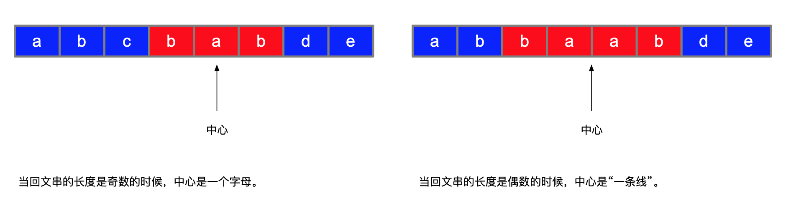
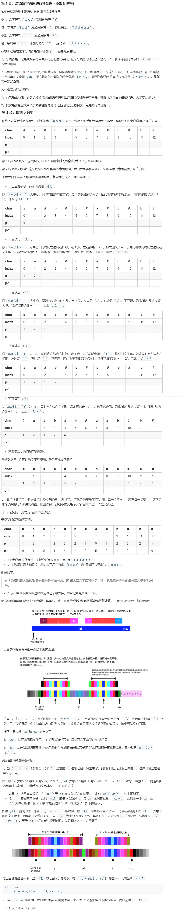

##### [原题链接](https://leetcode-cn.com/problems/longest-palindromic-substring/)

##### 难度 medium

##### 思路

###### 中心扩散

1. 字符串长度分偶数位和奇数位两种

2. 遍历每个字母，从该字母往外扩展寻找是否相同；因为可能是偶数位，所以再加上从两位字母基础上往外扩展。

     

###### 马拉车 

 

##### 代码

```java
// 动态规划
private static String longestPalindrome(String string) {
    int len = string.length();
    if (len <= 1)
        return string;
    int longest = 1;
    String str = string.substring(0, 1);
    boolean[][] dp = new boolean[len][len];
    // abcdedcba
    //   l   r
    // 如果 dp[l,r] = true 那么 dp[l+1,r-1] 也一定为 true
    // [l + 1,r - 1] 一定要构成至少两个元素额区间（ 1 个元素的区间，s.charAt(l)==s.charAt(r) 已经判断过了）
    // 即 l + 1 < r - 1，即 r > l + 2 (不能取等号，取到等号，就退化成 1 个元素的情况了)
    // 应该反过来写
    for (int r = 0; r < len; r++) {
        for (int l = 0; l <= r; l++) {
            // 区间应该慢慢放大
            if (string.charAt(r) == string.charAt(l) && (r - l <= 2 || dp[l + 1][r - 1])) {
                dp[l][r] = true;
                if (r - l + 1 > longest) {
                    longest = r - l + 1;
                    str = string.substring(l, r + 1);
                }
            }
        }
    }
    System.out.println(str);
    return str;
}


// 中心扩散
private static String longestPalindrome(String string) {
    int len = string.length();
    if (len <= 1)
        return string;
    int longest = 1;
    String str = string.substring(0, 1);
    for (int i = 0; i < len; i++) {
        // 奇数中心扩展
        String s1 = isCenterPalindrome(string, len, i, i);
        // 偶数中心扩展
        String s2 = isCenterPalindrome(string, len, i, i + 1);

        String maxLenStr = s1.length() > s2.length() ? s1 : s2;
        if (maxLenStr.length() >= longest)
            str = maxLenStr;
    }
    System.out.println(str);
    return str;
}
private static String isCenterPalindrome(String string, int len, int left, int right) {
    while (left >= 0 && right < len && string.charAt(left) == string.charAt(right)) {
        left--;
        right++;
    }
    // 最后满足条件的是 left 后一个和 right 前一个
    return string.substring(left + 1, right);
}


// Manacher
private static String longestPalindrome(String string) {
    int len = string.length();
    if (len <= 1)
        return string;
    
    String strDivide = divideStr(string, '#');
    len = strDivide.length();
    // 可扩散半径 + 1
    int[] p = new int[len];
    Arrays.fill(p, 1);
    int longest = 1;
    String str = string.substring(0, 1);
    // 最长回文子串的中间位置
    int middle = 0;
    // 最长回文子串的距离
    int maxRange = 0;
    for (int i = 0; i < len; i++) {
        // 根据对称性直接赋值
        if (i < maxRange) {
            p[i] = Math.min(p[2 * middle - i], maxRange - i);
        }
        // 从对称点获得p值，继续正常匹配
        while (i - p[i] >= 0 && i + p[i] < len && strDivide.charAt(i - p[i]) == strDivide.charAt(i + p[i])) {
            p[i]++;
        }
        // 重新定义最长的中心位置, 当前位置加上最大扩展距离
        if (i + p[i] > maxRange) {
            maxRange = i + p[i];
            middle = i;
        }
        if (p[i] - 1 > longest) {
            longest = p[i] - 1;
            str = strDivide.substring(i - p[i] + 1, i + p[i]).replace("#", "");
        }
    }
    System.out.println(str);
    return str;
}
private static String divideStr(String string, char divide) {
    StringBuilder str = new StringBuilder();
//		if (string.indexOf(divide) == -1)
//			throw new IllegalArgumentException("");
    str.append(divide);
    for (int i = 0; i < string.length(); i++) {
        str.append(string.charAt(i));
        str.append(divide);
    }
    return string.toString();
}
```

##### [参考链接](https://leetcode-cn.com/problems/longest-palindromic-substring/solution/zhong-xin-kuo-san-dong-tai-gui-hua-by-liweiwei1419/) 

