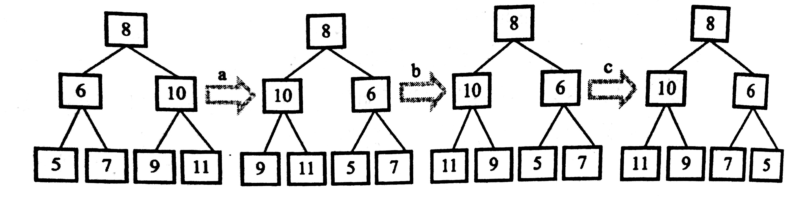
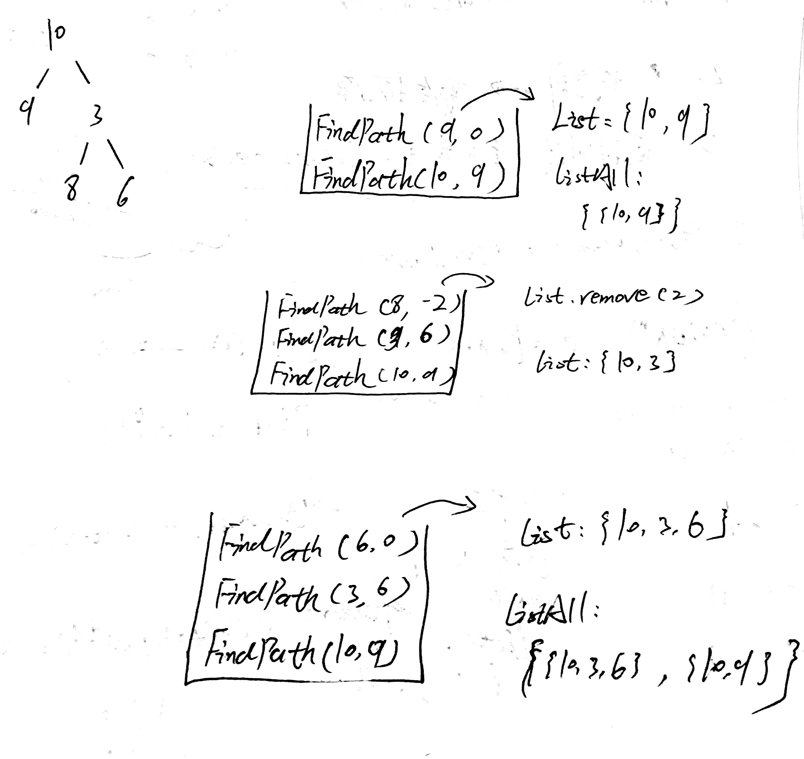
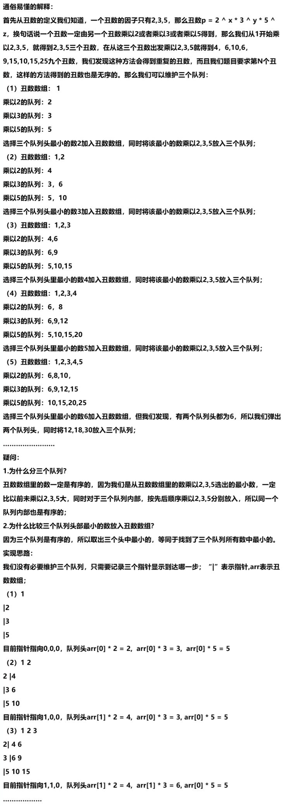
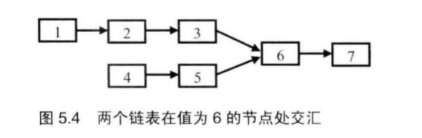
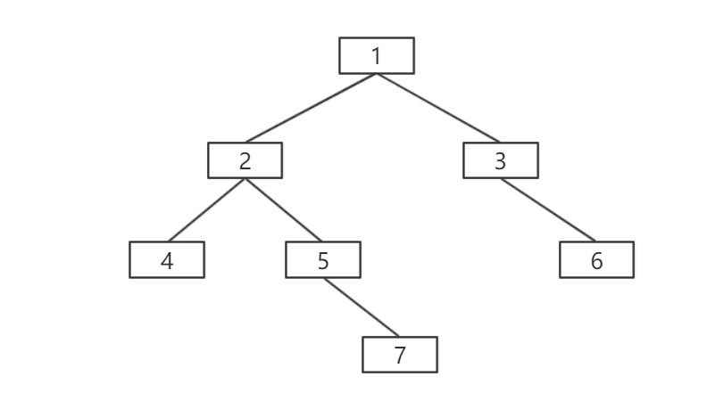
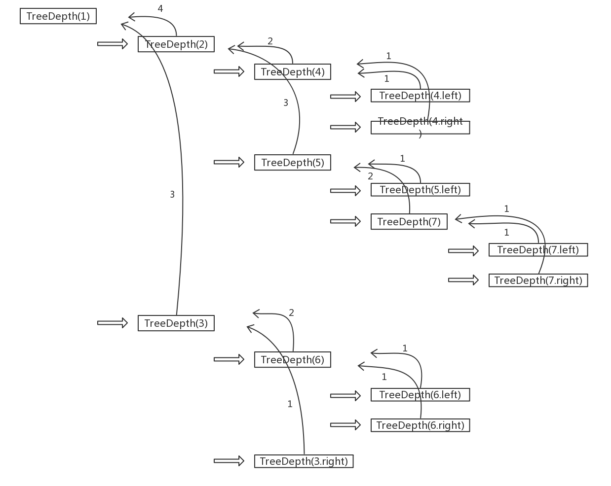
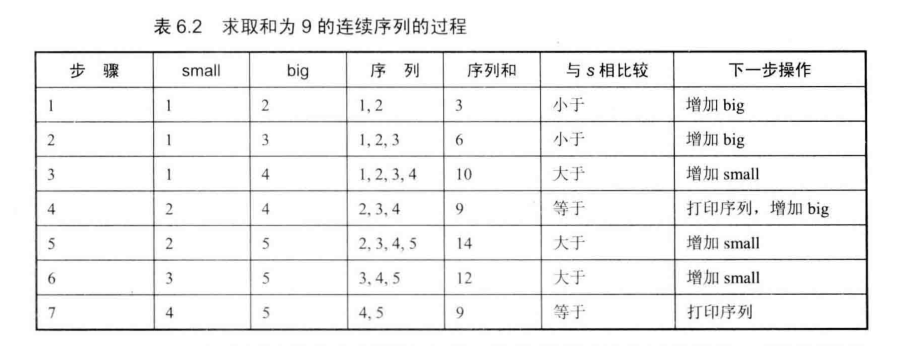

# <center>剑指Offer解题思路</center>


- [重建二叉树](#重建二叉树) 
- [二进制中1的个数](#二进制中1的个数) 
- [数值的整数次方](#数值的整数次方) 
- [调整数组顺序使奇数位于偶数前面](#调整数组顺序使奇数位于偶数前面 ) 
- [树的子结构](#树的子结构) 
- [二叉树的镜像](#二叉树的镜像) 
- [包含min函数的栈](#包含min函数的栈) 
- [栈的压入、弹出序列](#栈的压入、弹出序列) 
- [从上往下打印二叉树](#从上往下打印二叉树) 
- [二叉搜索树的后序遍历序列](#二叉搜索树的后序遍历序列) 
- [二叉树中和为某一值的路径](#二叉树中和为某一值的路径) 
- [复杂链表的复制](#复杂链表的复制) 
- [二叉搜索树与双向链表](#二叉搜索树与双向链表) 
- [字符串的排序](#字符串的排序) 
- [数组中出现次数超过一半的数字](#数组中出现次数超过一半的数字) 
- [最小的K个数](#最小的K个数) 
- [连续子数组的最大和](#连续子数组的最大和) 
- [把数组排成最小的数](#把数组排成最小的数) 
- [丑数](#丑数) 
- [第一个只出现一次的字符](#第一个只出现一次的字符) 
- [数组中的逆序对](#数组中的逆序对) 
- [两个链表的第一个公共结点](#两个链表的第一个公共结点) 
- [数字在排序数组中出现的次数](#数字在排序数组中出现的次数) 
- [二叉树的深度](#二叉树的深度) 
- [平衡二叉树](#平衡二叉树) 
- [数组中只出现一次的数字](#数组中只出现一次的数字) 
- [和为S的连续正数序列](#和为S的连续正数序列) 
- [和为S的两个数字](#和为S的两个数字) 
- [左旋转字符串](#左旋转字符串) 


## 重建二叉树

### 题目描述

输入某二叉树的前序遍历和中序遍历的结果，请重建出该二叉树。假设输入的前序遍历和中序遍历的结果中都不含重复的数字。例如输入前序遍历序列{1,2,4,7,3,5,6,8}和中序遍历序列{4,7,2,1,5,3,8,6}，则重建二叉树并返回。

### 解题思路

1. 前序遍历的第一位是根节点。
2. 中序遍历中，根节点左右两边分别是左子树和右子树。

### 代码

```java
public class Solution {
	public TreeNode reConstructBinaryTree(int[] pre, int[] in) {
		// 边界条件
		if (pre == null || in == null || pre.length != in.length) {
			return null;
		}
		return construct(pre, 0, pre.length - 1, in, 0, in.length - 1);
	}
	
	public TreeNode construct(int[] pre, int preS, int preE, int[] in, int inS, int inE) {
		if (preS > preE || inS > inE)
			return null;
		// 前序遍历的第一个是根节点,创建根节点
		TreeNode node = new TreeNode(pre[preS]);
		for (int i = inS; i <= inE; i++) {
			// 在中序遍历中寻找根节点
			if (in[i] == pre[preS]) {
				// 递归调用，根据当前根节点构建左子树
				node.left = construct(pre, preS + 1, preS + i - inS, in, inS, i - 1);
				// 递归调用，根据当前根节点构建右子树
				node.right = construct(pre, preS + i - inS + 1, preE, in, i + 1, inE);
			}
		}
		return node;
	}

}
```


## 二进制中1的个数

### 题目描述

输入一个整数，输出该数二进制表示中 *1* 的个数。其中负数用补码表示。

> 考察二进制和位运算。

### 解题思路

代码一：

 　1. 判断整数二进制最右边一位是不是1，然后整体向右移一位，最前面补0，直至整个整数为0。</br>
 　2. 例如整数10的二进制为0000 0000 0000 0000 0000 0000 0000 1010（Java的int类型占用4个字节，即32位）。只看后四位的话，右移一位变成0101，继续右移为0010、0001、0000，可见右移三次整数就变成0。若右移过程中最后一位为1，则记录下来。</br>
 　3. 至于如何判断最后一位是否为1，可以把整数和1进行与操作判断结果是否为1即可。</br>
 　4. 缺点：如果整数是负数，则代码一会报错，因为在对负数进行右移运算时，补的是1，这样会导致死循环。

代码二：

 　1. 优化：让整数和1进行与运算，判断整数的末位是否为1；让1左移，判断倒数第二位是否为1......。例如给定整数10，二进制为1010，和1即二进制0001进行与操作，结果不为1；让1左移一位，即0001变为0010，再和1与操作，结果为1，记录下来......。</br>
 　2. 缺点：整数的二进制有多少个1就要循环多少次。

代码三：

 　1. 若整数的二进制最后一位为1，减1后最后一位变成0。例如1001 - 0001 = 1000.</br>
 　2. 若整数的二进制最后一位不为1，最后那个1是第n位，则减1后第n位的1变成0，之后的0都变为1，之前的不变。例如1100，最右边的1在第2位，减1后：1100 - 0001 = 1011。</br>
 　3. 总结：把整数减1，就是将整数的二进制最右边那个1之后的0都变成1。</br>
 　4. 接着将整数和减1的结果做与运算，作用是将第n位后的1都变成0。例如1100减1后为1011，将1100和1011与运算后为1000。</br>
 　5. 继续使用减1，与运算之后的数进行循环，直至整数变为0。</br>
 　6. 优点：整数的二进制有多少位1就运行多少次。

### 代码

```java
// 代码一
public int NumberOf(int n) {
    int count = 0;
    while(n != 0){
        if((n & 1) == 1){
            count++;
        }
        count = count >> 1;
    }
    return count;
}
```

```java
// 代码二
public int NumberOf(int n) {
    int count = 0;
    int flag = 1;
    while(flag != 0){
        if((n & flag) != 0){
            count++;
        }
        flag = flag << 1;
    }
    return count;
}
```

```java
// 代码三
public int NumberOf(int n) {
    int count = 0;
    while(n != 0){
        count++;
        n = (n - 1) & n;
    }
    return count;
}
```


------


## 数值的整数次方

### 题目描述

给定一个 *double* 类型的浮点数 *base* 和 *int* 类型的整数 *exponent* 。求 *base* 的 *exponent* 次方。

### 解题思路

 1. 首先考虑 *base* 和 *exponent* 的取值范围，如下图所示：

    

 2. 时间复杂度 *O(n)* ：使用 *base* 相乘 *exponent* 次求整数次方。

 3. 时间复杂度 *O(logn)* ：快速幂求解。


### 代码

```java
public class Solution {
    public double Power(double base, int exponent) {
        int index = 0;
        double res = 1;
        if(exponent > 0){
            index = exponent;
        }else if(exponent < 0){
            if(base == 0){
                return -1;
            }
            index = -exponent;
        }else{
            if(base == 0){
                return 0;
            }
            return 1;
        }
        while(index != 0){
            if((index & 1) == 1){
                res *= base;
            }
            base *= base;
            index = index >> 1;
        }
        return exponent>0?res:(1/res);
    }
}
```


------


## 调整数组顺序使奇数位于偶数前面 

### 题目描述

　输入一个整数数组，实现一个函数来调整该数组中数字的顺序，使得所有的奇数位于数组的前半部分，所有的偶数位于数组的后半部分，并保证奇数和奇数，偶数和偶数之间的相对位置不变。

### 解题思路

方法一：利用插入排序的思想。

1. 找到第一个偶数的位置 *p* ，从下一个位置 *p+1* 开始遍历数组。例如 *[1, 2, 3, 4, 5, 6, 7]*，*p = 1* ，从下标 *2* 遍历数组
2. 找到第一个奇数，位置为 *j*，从 *p* 到 *j-1* 的元素依次后移一位，空出位置 *p* 放找到的那个奇数。

方法二：利用冒泡排序的思想。

1. 将最右边的偶数冒泡移到最后一位。
2. 依次将偶数往后移...

### 代码

```java
// 代码一
public void reOrderArray(int [] array) {

    if(array == null || array.length == 0)   return;

    int p = 0;
    for(int i=0; i<array.length; i++){
        if(array[i]%2 == 0){
            p = i;
            break;
        }
    }

    if(p == array.length)   return;

    for(int i=p+1; i<array.length; i++){
        if(array[i] % 2 == 1){
            int j = i;
            int temp = array[j];
            while(j > p){
                array[j] = array[j-1];
                j--;
            }
            array[p] = temp;
            p++;
        }
        
    }
}
```

```java
// 代码二
public void reOrderArray(int [] array) {
    for(int i=0; i<array.length-1; i++){
        for(int j=0; j<array.length-1-i; j++){
            if(array[j]%2==0 && array[j+1]%2==1){
                int temp = array[j];
                array[j] = array[j+1];
                array[j+1] = temp;
            }
        }
    }
}
```


------


## 树的子结构

### 题目描述

输入两棵二叉树A，B，判断B是不是A的子结构。（ps：我们约定空树不是任意一个树的子结构）

### 解题思路

1. 找到二叉树A中对应二叉树B的根节点相同的节点。
2. 递归的判断A和B的左子树和右子树是否相同。

### 代码

```java
/**
public class TreeNode {
    int val = 0;
    TreeNode left = null;
    TreeNode right = null;

    public TreeNode(int val) {
        this.val = val;
    }
}
*/

public class Solution {
	
	public boolean HasSubtree(TreeNode root1,TreeNode root2) {
		boolean res = false;
        // 若A、B皆为空树时，返回false
        if (root1 != null && root2 != null) {
            // 找到A树中与B树根节点相对应的节点
			if (root1.val == root2.val) {
				res = Tree1haveTree2(root1, root2);
			}
            // 若没有，继续从A树的左右子树中寻找
			if (!res) {
				res = Tree1haveTree2(root1.left, root2);
			}
			if (!res) {
				res = Tree1haveTree2(root1.right, root2);
			}
		}
        return res;
    }

	public boolean Tree1haveTree2(TreeNode root1, TreeNode root2) {
        // 下面两个判断条件不能互换的
        // B树完美的遍历完，返回true
		if (root2 == null) {
			return true;
		}
        // 到这里时B树还没遍历完，A树就遍历完了，返回false
		if (root1 == null) {
			return false;
		}
        // A树和B树没有对应上，返回false
		if (root2.val != root1.val) {
			return false;
		}
        // 判断A树的左右节点是否仍和B树相对应
		return Tree1haveTree2(root1.left, root2.left) && Tree1haveTree2(root1.right, root2.right);
	}
}
```


---


## 二叉树的镜像

### 题目描述

操作给定的二叉树，将其变换为源二叉树的镜像。

```
二叉树的镜像定义：源二叉树 
    	    8
    	   /  \
    	  6   10
    	 / \  / \
    	5  7 9 11
    	镜像二叉树
    	    8
    	   /  \
    	  10   6
    	 / \  / \
    	11 9 7  5
```

### 解题思路

交换当前结点的左右结点后，整个左右子树也是交换了的，见下图：



### 代码

```java
// 递归
public void Mirror(TreeNode root) {
    if (root == null)	return;
    if (root.left == null && root.right == null)	return;
    // 交换当前结点的左右子树
    TreeNode tempNode = root.left;
    root.left = root.right;
    root.right = tempNode;
    if (root.left != null) {
        Mirror(root.left);
    }
    if (root.right != null) {
        Mirror(root.right);
    }
}

// 非递归
public void Mirror(TreeNode root) {
    if (root == null)	return;
    if (root.left == null && root.right == null)	return;
    Stack<TreeNode> stack = new Stack<>();
    // 先将根结点压人栈中
    stack.push(root);
    while(!stack.isEmpty()) {
        // 取出栈顶元素，即当前的根结点
        TreeNode node = stack.pop();
        // 交换左右子树
        if (node.left != null || node.right != null) {
            TreeNode tempNode = node.left;
            node.left = node.right;
            node.right = tempNode;
        }
        // 若当前结点有左结点，压人栈中
        if (node.left != null) {
            stack.push(node.left);
        }
        // 若当前结点有右结点，压人栈中
        if (node.right != null) {
            stack.push(node.right);
        }
    }
}
```


---


## 包含min函数的栈

### 题目描述

　定义栈的数据结构，请在该类型中实现一个能够得到栈中所含最小元素的 $min$ 函数（时间复杂度应为 $O(1)$）。

### 解题思路

 1. 定义一个辅助栈，用来存储当前栈中最小的数。

 2. 将数据压入栈中时，比较当前数据和辅助栈栈顶元素大小。

 3. 若栈顶元素大，则把当前数据压入辅助栈中；反之，再次压入栈顶元素。

 4. 例如入栈元素为：*7 4 5 9 2 3 1 4*

    辅助栈中元素为：*7 4 4 4 2 2 1 1*

### 代码

```java
import java.util.Stack;
public class Solution {
    Stack<Integer> stack1 = new Stack<Integer>();
    Stack<Integer> stack2 = new Stack<Integer>();
    
    public void push(int node) {
        stack1.push(node);
        if(stack2.empty()){
            stack2.push(node);
        }else{
            int temp = stack2.peek();
            if(node<=temp){
                 stack2.push(node);   
            }else{
                stack2.push(temp);
            }
        }
    }
    
    public void pop() {
        stack1.pop();
        stack2.pop();
    }
    
    public int top() {
        return stack1.peek();
    }
    
    public int min() {
        return stack2.peek();
    }
}
```


------


## 栈的压入、弹出序列

### 题目描述

　输入两个整数序列，第一个序列表示栈的压入顺序，请判断第二个序列是否可能为该栈的弹出顺序。假设压入栈的所有数字均不相等。例如序列 *1,2,3,4,5* 是某栈的压入顺序，序列 *4,5,3,2,1* 是该压栈序列对应的一个弹出序列，但 *4,3,5,1,2* 就不可能是该压栈序列的弹出序列。（注意：这两个序列的长度是相等的）。

### 解题思路

 　1. 借助一个辅助栈，将第一个序列的元素挨个压入栈中；
 　2. 压入栈中的同时和第二个序列进行比较，若相同则弹出，反之继续压入；
 　3. 当与第二个序列比较完毕后，若栈空则第二个序列是第一个序列的弹出顺序，反之不是。

### 代码

```java
import java.util.ArrayList;
import java.util.Stack;

public class Solution {
    public boolean IsPopOrder(int [] pushA,int [] popA) {
        if(pushA.length==0 || popA.length==0)    return false;
        Stack<Integer> stack = new Stack<Integer>();
        int index = 0;
        for(int i=0; i<pushA.length; i++){
            stack.push(pushA[i]);
            while(!stack.empty() && stack.peek()==popA[index]){
                stack.pop();
                index++;
            }
        }
        return stack.empty();
    }
}
```


------

## 从上往下打印二叉树

### 题目描述

从上往下打印出二叉树的每个节点，同层节点从左至右打印。

    	    8
    	   /  \
    	  6   10
    	 / \  / \
    	5  7 9 11
### 解题思路

1. 这是二叉树的层序遍历呀
2. 设置一个队列，从根结点开始入队，将其左右结点6和8入队
3. 按照层次，将6出队，把其左右结点5和7再入队，...

### 代码

```java
import java.util.ArrayList;
import java.util.LinkedList;
import java.util.Queue;
/**
public class TreeNode {
    int val = 0;
    TreeNode left = null;
    TreeNode right = null;

    public TreeNode(int val) {
        this.val = val;
    }
}
*/
public class Solution {
    public ArrayList<Integer> PrintFromTopToBottom(TreeNode root) {
        ArrayList<Integer> list = new ArrayList<>();
        if (root == null) {
			return list;
		}
        Queue<TreeNode> queue = new LinkedList<>();
        queue.add(root);
        while(!queue.isEmpty()) {
        	TreeNode node = queue.poll();
        	list.add(node.val);
        	if (node.left != null) {
        		queue.add(node.left);
        	}
        	if (node.right != null) {
				queue.add(node.right);
			}
        }
        return list;
    }
}
```


---

## 二叉搜索树的后序遍历序列

### 题目描述

输入一个整数数组，判断该数组是不是某二叉搜索树的后序遍历的结果。如果是则输出Yes,否则输出No。假设输入的数组的任意两个数字都互不相同。

	    8
	   /  \
	  6   10
	 / \  / \
	5  7 9 11
	
	后序遍历：5 7 6 9 11 10 8
### 解题思路

1. 二叉搜索树每个结点的左子树都比它小，右子树都比它大。
2. 后序遍历的最后一个是根结点。
3. 遍历数组，找到第一个大于根结点的数，该数左边为左子树，右边为右子树。
4. 若该数右边还有小于根结点的数，则不是一个后序遍历。
5. 依次对左边和右边进行2-4的操作。

### 代码

```java
public class Solution {
	
	public boolean VerifySquenceOfBST(int [] sequence) {
        if (sequence.length == 0) {
			return false;
		}
        if (sequence.length == 1) {
			return true;
		}
        return midSearch(sequence, 0, sequence.length-1);
    }

	public boolean midSearch(int[] sequence, int left, int right) {
		if (left >= right) {
			return true;
		}
		int i = left;
		while (sequence[i] < sequence[right]) {
			i++;
		}
		for (int j = i; j < right; j++) {
			if (sequence[j] < sequence[right]) {
				return false;
			}
		}
		return midSearch(sequence, left, i - 1) && midSearch(sequence, i + 1, right - 1);
	}

}
```


---

## 二叉树中和为某一值的路径

### 题目描述

输入一颗二叉树的跟节点和一个整数，打印出二叉树中结点值的和为输入整数的所有路径。路径定义为**从树的根结点开始往下一直到叶结点**所经过的结点形成一条路径。(注意: 在返回值的list中，数组长度大的数组靠前)

### 解题思路

        10
       /  \
      9    3
          / \
         8   6
    targrt：19
使用递归遍历二叉树。

遍历过程：



### 代码

```java
import java.util.ArrayList;
/**
public class TreeNode {
    int val = 0;
    TreeNode left = null;
    TreeNode right = null;

    public TreeNode(int val) {
        this.val = val;
    }
}
*/
public class Solution {
    // 放在函数外，防止递归时把原来的值覆盖
    // 存放所有的路径
    ArrayList<ArrayList<Integer>> listAll = new ArrayList<ArrayList<Integer>>();
    // 存放当前寻找的路径
	ArrayList<Integer> list = new ArrayList<>();
    
    public ArrayList<ArrayList<Integer>> FindPath(TreeNode root,int target) {
        if (root == null)	return listAll;
        list.add(root.val);
        target -= root.val;
        // 满足到达叶子结点
        if ((target == 0) && root.left == null && root.right == null) {
        	int listCount = 0;
            // 按照数组长度放入listAll中
        	while (listCount < listAll.size() && list.size() < listAll.get(listCount).size()) {
        		listCount++;
        	}
			listAll.add(listCount, new ArrayList<Integer>(list));
		}
        FindPath(root.left, target);
        FindPath(root.right, target);
        // 若已经到达叶子结点还不满足条件，将当前的叶子结点去掉，递归返回上一层。
        list.remove(list.size()-1);
        return listAll;
    }
}
```


---

## 复杂链表的复制

### 题目描述

输入一个复杂链表（每个节点中有节点值，以及两个指针，一个指向下一个节点，另一个特殊指针指向任意一个节点），返回结果为复制后复杂链表的head。（注意，输出结果中请不要返回参数中的节点引用，否则判题程序会直接返回空）

### 解题思路

思路一：

1. 遍历链表，同时新建一个一样链表，这样两个链表有相同的 *next* 指针。
2. 遍历链表的同时，将每个元素的 *random* 指向元素存入一个哈希表。
3. 在新链表中，为每个元素都遍历一遍链表建立 *random* 指针。
4. 问题：若链表中有相同的元素，则方法失败。

思路二：

1. 在旧链表中的每个元素后面复制该元素。

   

2. 给每个复制的元素添加 *random* 指针。

   

3. 把新旧链表分开。

   

### 代码

```java
// 思路二
public class Solution {
    
    public RandomListNode Clone(RandomListNode pHead) {
        // 为空链，返回null
        if (pHead == null) {
    		return null;
    	}
        // 创建当前链表第一个节点的引用
    	RandomListNode newNode = pHead;
        // 复制next，A->B->C => A->A'->B->B'->C->C'
    	while (newNode != null) {
    		RandomListNode node = new RandomListNode(newNode.label);
    		node.next = newNode.next;
    		newNode.next = node;
    		newNode = node.next;
    	}
        // 重新变为第一个节点的引用
    	newNode = pHead;
        // 复制链表random指针
    	while (newNode != null) {
            // 有的节点random指针为空
    		if (newNode.random != null) {
                // 若A指向C，则A‘必然指向C后面的C’
    			newNode.next.random = newNode.random.next;
    		}
            // 往后跳一个，比如A后面是它的复制值A‘，再后面一个才是B
    		newNode = newNode.next.next;
    	}
        // 重新变为第一个节点的引用
    	newNode = pHead;
        // head是要返回的新的链表的头节点
    	RandomListNode Head = newNode.next;
        // 新的链表的头节点的引用
    	RandomListNode tempNode = Head;
        // 因为已经排除了是空链表，所以先将旧链表的头结点指向旧链表的第二个节点
    	newNode.next = tempNode.next;
    	newNode = newNode.next;
        // 拆开链表
    	while (newNode != null) {
    		tempNode.next = newNode.next;
    		tempNode = tempNode.next;
    		newNode.next = tempNode.next;
    		newNode = newNode.next;
    	}
    	return Head;
    }
}
```

---


## 二叉搜索树与双向链表

### 题目描述

输入一棵二叉搜索树，将该二叉搜索树转换成一个排序的双向链表。要求不能创建任何新的结点，只能调整树中结点指针的指向。

### 解题思路

二叉搜索树，左结点都小于根结点，右结点都大于根节点。

排序的链表就是中序遍历一下而已。

         10
        /  \
       5    16
       \    / \
        8  12  25
1. 满足条件 *pRootOfTree != null* ，将 10 16 25 按顺序入栈
2. 链表第一位 *pRootOfTree = 25* 出栈，给其一个引用 *pre* 
3. *pRootOfTree* 指向其左子树，但是为空
4.  *pRootOfTree = 16* 出栈，和 *25* 连接，此时链表为：16 25
5. *pRootOfTree* 指向其左子树，值为 12
6. 满足条件 *pRootOfTree != null* ，将 12 入栈，此时栈：10 12
7. *pRootOfTree = 12* 出栈，和 16 连接，此时链表为：12 16 25
8. *pRootOfTree* 指向其左子树，值为空
9. *pRootOfTree = 10* 出栈，和 12 连接，此时链表为：10 12 16 25
10. *pRootOfTree* 指向其左子树，值为 5
11. 满足条件 *pRootOfTree != null* ，将 5 和它的右子树入栈，此时栈：5 8
12. *pRootOfTree = 8* 出栈，和 10 连接，此时链表为：8 10 12 16 25
13. *pRootOfTree* 指向其左子树，值为空
14. *pRootOfTree = 5* 出栈，和 8 连接，此时链表为：5 8 10 12 16 25
15. *pRootOfTree* 指向其左子树，值为空，同时栈也为空，返回 *pre*

### 代码

```java
// 代码一   非递归：右 中 左
import java.util.Stack;

public TreeNode Convert(TreeNode pRootOfTree) {
    if (pRootOfTree == null) {
        return null;
    }
    Stack<TreeNode> stack = new Stack<>();
    TreeNode pre = null;
    // 
    while (pRootOfTree != null || !stack.isEmpty()) {
        // 若当前结点不为空，将该结点以及右结点压入栈中
        while (pRootOfTree != null) {
            stack.push(pRootOfTree);
            pRootOfTree = pRootOfTree.right;
        }
        // 得到当前结点
        pRootOfTree = stack.pop();
        // 给最大的值，即当前的头结点附一个引用pre
        if (pre == null) {
            pre = pRootOfTree;
        }else {
            // 将两个结点串在一块，同时pre向前走一位，作为当前第一个结点的引用
            pRootOfTree.right = pre;
            pre.left = pRootOfTree;
            pre = pRootOfTree;
        }
        // 防止当前结点还有左子树
        // 若有，则在下一次循环中将其左子树的根节点以及左子树的根节点的所有右结点压入栈中
        pRootOfTree = pRootOfTree.left;
    }
    return pre;
}
```

```java
// 代码二 	非递归：左 中 右
// 需要多存储一个头结点变量
import java.util.Stack;

public TreeNode Convert(TreeNode pRootOfTree) {
    if (pRootOfTree == null) {
        return null;
    }
    TreeNode pre = null;
    TreeNode newNode = null;
    Stack<TreeNode> stack = new Stack<>();
    while (pRootOfTree != null || !stack.isEmpty()) {
        while (pRootOfTree != null) {
            stack.push(pRootOfTree);
            pRootOfTree = pRootOfTree.left;
        }
        pRootOfTree = stack.pop();
        if (pre == null) {
            pre = pRootOfTree;
            newNode = pRootOfTree;
        }else {
            pRootOfTree.left = pre;
            pre.right = pRootOfTree;
            pre = pRootOfTree;
        }
        pRootOfTree = pRootOfTree.right;
    }
    return newNode;
}
```

```java
// 代码三 递归：右 中 左
TreeNode pre = null;
public TreeNode Convert(TreeNode pRootOfTree) {
    if (pRootOfTree == null) {
        return pRootOfTree;
    }
    Convert(pRootOfTree.right);
    if (pre == null) {
        pre = pRootOfTree;
    }else {
        pre.left = pRootOfTree;
        pRootOfTree.right = pre;
        pre = pRootOfTree;
    }
    Convert(pRootOfTree.left);
    return pre;
}
```

---


## 字符串的排序

### 题目描述

 　输入一个字符串,按字典序打印出该字符串中字符的所有排列。例如输入字符串abc,则打印出由字符a,b,c所能排列出来的所有字符串 *abc,acb,bac,bca,cab* 和 *cba* 。

### 解题思路

​	依次将每个字符交换到最前面，之后按相同的方式排列剩下的字符。如下图所示：


### 代码

```java

import java.util.ArrayList;
import java.util.Collections;
public class Solution{

    public ArrayList<String> Permutation(String str) {
        ArrayList<String> list = new ArrayList<String>();
        if(str!=null){
            strPermutation(str.toCharArray(), 0, list);
            Collections.sort(list);
        }
        return list;
    }
    public void strPermutation(char[] ch, int k, ArrayList<String> list){
        if(k == ch.length-1){
            if(!list.contains(String.valueOf(ch))){
                list.add(String.valueOf(ch));
            }
        }else{
            for(int j=k; j<ch.length; j++){
                swap(ch, k, j);
                strPermutation(ch, k+1, list);
                swap(ch, k, j);
            }
        }
    }
    public void swap(char[] ch, int k, int j){
        if(k!=j){
         	char temp = ch[k];
        	ch[k] = ch[j];
        	ch[j] = temp;   
        }
    }
}
```


------


## 数组中出现次数超过一半的数字

### 题目描述

　数组中有一个数字出现的次数超过数组长度的一半，请找出这个数字。例如输入一个长度为9的数组{1,2,3,2,2,2,5,4,2}。由于数字2在数组中出现了5次，超过数组长度的一半，因此输出2。如果不存在则输出0。

### 解题思路

方法一：

1. 若数组中有出现次数超过一半的数字，那么该数字出现的次数肯定比剩下所有的数出现的次数之和还要大；
2. 设两个变量，*res* 表示数字，*index* 表示数字 *res* 出现的次数；
3. 循环数组，若出现的数字保存的数字相同，次数加 *1* ，不同则减 *1* ；
4. 最后将 *index* 置为 *1* 的数字 *res* 就是可能就是出现次数最多的那个数字。
5. 判断该数字出现次数是否大于数组长度的一半。

方法二：

1. 若数组中有出现次数超过一半的数字，那么经过排序后，数组的中位数肯定是该数字，所以先找到排好序的中位数；
2. 使用快排，每一次快排后，总会有一个数，其左边左右的数都比它小，右边的都比它大，返回其下标；
3. 若该数所在下标刚好等于 *n / 2* ，则该数即为中位数；若大于 *n / 2* ，则中位数在该数的左侧；反之，则在右侧；
4. 经过多次快排，得到中位数，然后遍历数组，判断该数字出现次数是否大于数组长度的一半。

### 代码

```java
// 代码一
public int MoreThanHalfNum_Solution(int [] array) {
    if(array.length <= 0)   return 0;
    int index = 1, res = array[0];
    for(int i=1; i<array.length; i++){
        if(index == 0){
            res = array[i];
            index = 1;
        }
        if(array[i] == res){
            index++;
        }else{
            index--;
        }
        
    }
    int count = 0;
    for(int i=0; i<array.length; i++){
        if(array[i] == res)     count++;
    }
    if(count <= array.length/2){
        return 0;
    }
    return res;
}
```

```java
// 代码二
public int MoreThanHalfNum_Solution(int [] array) {
        if(array.length <= 0)   return 0;
        int middle = array.length >> 1;
        int left = 0, right = array.length - 1;
        int index = headAndTailPartion(array, left, right);
        while(index != middle){
            if(index < middle){
                index = headAndTailPartion(array, index+1, right);
            }else{
                index = headAndTailPartion(array, index, index-1);
            }
        }
        
        int res = array[index];
        int count = 0;
        for(int i=0; i<array.length; i++){
            if(array[i] == res)     count++;
        }
        if(count <= array.length/2){
            return 0;
        }
        return res;
    }
    
    public int headAndTailPartion(int[] array, int left, int right){
        int pivot = array[left];
        while(left < right){
            while(left < right && array[right] > pivot){
                right--;
            }
            while(left < right && array[left] < pivot){
                left++;
            }
            if(left < right){
                swap(array[left], array[right]);
                left++;
                right--;
            }
        }
        swap(pivot, array[right]);
        return right;
    }
    
    public static void swap(int aleft, int aright){
        int temp = aleft;
        aleft = aright;
        aright = temp; 
    }
```

---


## 最小的K个数

### 题目描述

输入n个整数，找出其中最小的K个数。例如输入4,5,1,6,2,7,3,8这8个数字，则最小的4个数字是1,2,3,4。》

> > 主要考察堆

### 解题思路

方法一：

1. 冒泡排序：每次将最小的数咕噜咕噜到最后面
2. 咕噜 K 次，最后面的 K 个数就是要求的

方法二：

1. 将 K 个数放入数组中，第一个是这 K 个数中最小的
2. 将剩下的数依次和第一个比较，若该数小，则替换数组中第一个元素，并将该数放入正确的位置

方法三：

1. 使用大顶堆替代数组来保存 K 个数，那么堆顶就是 K 个数的最大值
2. 将剩下的数依次和堆顶比较，若该数小，则替换堆顶，重新调整

### 代码

```java
// 方法三
// 建大顶堆
public static void creatHeap(int[] arr, int n) {
    for (int i = (n - 1) / 2; i >= 0; i--) {
        percolateDown(arr, i, n);
    }
}

// 删除栈顶元素并调整
private static void deleteHeap(int[] arr, int data, int n) {
    arr[0] = data;
    percolateDown(arr, 0, n);
}

// 下滤
private static void percolateDown(int[] arr, int i, int n) {
    // 第一个叶子结点的父结点
    int fatherdata = arr[i];
    // 该父结点左孩子的索引
    int child = 2 * i + 1;
    while (child <= n) {
        // 判断左孩子和右孩子较大的那个
        if (child + 1 <= n && arr[child + 1] > arr[child]) {
            child += 1;
        }
        // 若父结点比孩子结点都大，直接跳出
        if (fatherdata > arr[child]) {
            break;
        }
        // 调整父结点和子结点
        arr[i] = arr[child];
        arr[child] = fatherdata;
        i = child;
        child = i * 2 + 1;
    }
}

public static ArrayList<Integer> GetLeastNumbers_Solution(int[] input, int k) {
    ArrayList<Integer> list = new ArrayList<Integer>();
    if (input == null || input.length < k) {
        return list;
    }
    creatHeap(input, k - 1);
    for (int i = k; i < input.length; i++) {
        // 是否比堆顶元素大
        if (input[i] < input[0]) {
            deleteHeap(input, input[i], k - 1);
        }
    }
    for (int i = 0; i < k; i++) {
        list.add(input[i]);
    }
    return list;
}
```

---


## 连续子数组的最大和

### 题目描述

HZ偶尔会拿些专业问题来忽悠那些非计算机专业的同学。今天测试组开完会后,他又发话了:在古老的一维模式识别中,常常需要计算连续子向量的最大和,当向量全为正数的时候,问题很好解决。但是,如果向量中包含负数,是否应该包含某个负数,并期望旁边的正数会弥补它呢？例如:{6,-3,-2,7,-15,1,2,2},连续子向量的最大和为8(从第0个开始,到第3个为止)。给一个数组，返回它的最大连续子序列的和，你会不会被他忽悠住？(子向量的长度至少是1)

> 最大子序和问题

### 解题思路

方法一：

1. 设置两个变量： *maxsum* 保存最大值，*thissum* 保存到当前数字为止的累加和
2. 若 *thissum* 为正，则继续累加

方法二：

1. 动态规划的思想：每次比较当前数 和 当前数字与其之前最大累加和的和
2. 公式：$ f(x) = max(array[i], f(i-1) + array[i]) $

### 代码

```java
// 代码一
public class Solution {
    public int FindGreatestSumOfSubArray(int[] array) {
        int maxsum = array[0], thissum = array[0];
		for (int i = 1; i < array.length; i++) {
			thissum = thissum < 0 ? array[i] : thissum + array[i];
			maxsum = thissum > maxsum ? thissum : maxsum;
		}
		return maxsum;
    }
}
```

```java
// 代码二
public class Solution {
    public int FindGreatestSumOfSubArray(int[] array) {
        int maxsum = array[0], thissum = array[0];
		for (int i = 1; i < array.length; i++) {
			thissum = Math.max(array[i], thissum + array[i]);
			maxsum = Math.max(maxsum, thissum);
		}
		return maxsum;
    }
}
```

---


## 把数组排成最小的数

## 题目描述

输入一个正整数数组，把数组里所有数字拼接起来排成一个数，打印能拼接出的所有数字中最小的一个。例如输入数组{3，32，321}，则打印出这三个数字能排成的最小数字为321323。

### 解题思路

方法一：

1. 参考字符串的排序，对数组进行全排列
2. 然后选出最小的那个
3. *n* 个数字共有 n！个排列，时间复杂度太高

方法二：

1. 若 ab > ba ，说明 b 应该放在 a 的前面，比如 5，31
2. 根据这个规则，可以使用冒泡排序，对数字两两比较，将该放在后面的 b 咕噜到最后一位。比如 5，31，4。5肯定是放在最后一位的
3. 每次咕噜一个最大的到数组后面，最后将数组转换为字符串

### 代码

```java
// 方法二
import java.util.ArrayList;
import java.math.BigInteger;
public class Solution {
    public String PrintMinNumber(int [] numbers) {
        if (numbers.length == 0) return "";
        String str = "";
        for (int i = 0; i < numbers.length - 1; i++) {
			for (int j = 0; j < numbers.length - i - 1; j++) {
                // 给定的数字可能超出Integer的最大范围
				BigInteger a = new BigInteger(numbers[j] + "" + numbers[j + 1]);
				BigInteger ra = new BigInteger(numbers[j + 1] + "" + numbers[j]);
                // 若数组 ab > ba，将 a 和 b 互换
				if (a.compareTo(ra) == 1) {
					int temp = numbers[j];
					numbers[j] = numbers[j + 1];
					numbers[j + 1] = temp;
				}
			}
		}
        for (int i = 0; i < numbers.length; i++) {
			str += String.valueOf(numbers[i]);
		}
        return str;
    }
}
```

---


## 丑数

### 题目描述

把只包含质因子2、3和5的数称作丑数（Ugly Number）。例如6、8都是丑数，但14不是，因为它包含质因子7。 习惯上我们把1当做是第一个丑数。求按从小到大的顺序的第N个丑数。

### 解题思路

方法一：

1. 丑数最后肯定能被 2，3，5 这三个数整除
2. 暴力从 1 开始解决，缺点是不是丑数的数字也会进行计算。提交显示超时

方法二：



> 借用一位牛友的回答 -> [点此查看原回答](<https://www.nowcoder.com/questionTerminal/6aa9e04fc3794f68acf8778237ba065b?toCommentId=1314313>) 

### 代码

```java
// 方法一
public class Solution {
    public static int GetUglyNumber_Solution(int index) {
    	if (index <= 0)
    		return 0;
    	int count = 0, number = 0;
    	while (count < index) {
    		number++;
    		if (isUgly(number)) {
    			count++;
    		}
    	}
    	System.out.println(number);
        return number;
    }
    
    private static boolean isUgly(int number) {
    	while (number % 2 == 0) {
    		number /= 2;
    	}
    	while (number % 3 == 0) {
    		number /= 3;
    	}
    	while (number % 5 == 0) {
    		number /= 5;
    	}
    	return (number == 1) ? true : false;
	}
    
}

```

```java
// 方法二
public class Solution {
	public int GetUglyNumber_Solution(int index) {
		if (index <= 0)
    		return 0;
		int[] res = new int[index];
		res[0] = 1;
		int l1 = 0, l2 = 0, l3 = 0;
		for (int i = 1; i < index; i++) {
			res[i] = findMin(res[l1] * 2, res[l2] * 3, res[l3] * 5);
			if (res[i] == res[l1] * 2)
				l1++;
			if (res[i] == res[l2] * 3)
				l2++;
			if (res[i] == res[l3] * 5)
				l3++;
		}
		System.out.println(res[index - 1]);
		return res[index - 1];
    }
    
    
	private int findMin(int i, int j, int k) {
		int min = Math.min(i, j);
		return Math.min(min, k);
	}
    
}
```

---


## 第一个只出现一次的字符

### 题目描述

在一个字符串 (0<=字符串长度<=10000，全部由字母组成) 中找到第一个只出现一次的字符,并返回它的位置, 如果没有则返回 -1（需要区分大小写）.

### 解题思路

1. 使用哈希表存储字母，每次出现值就加 1
2. 遍历字符串，并从哈希表中取出其 value ，如果是 1 ，返回位置

### 代码

```java
import java.util.HashMap;
public class Solution {
    public int FirstNotRepeatingChar(String str) {
        HashMap<Character, Integer> map = new HashMap<Character, Integer>();
		for (int i = 0; i < str.length(); i++) {
			char key = str.charAt(i);
			if (!map.containsKey(key)) {
				map.put(key, 1);
			}else {
				int count = map.get(key);
				map.put(key, ++count);
			}
		}
		int pos = -1;
		for (int i = 0; i < str.length(); i++) {
			if (map.get(str.charAt(i)) == 1)	
				return i;
		}
        return pos;
    }
}
```

---


## 数组中的逆序对

### 题目描述

在数组中的两个数字，如果前面一个数字大于后面的数字，则这两个数字组成一个逆序对。输入一个数组,求出这个数组中的逆序对的总数P。并将P对1000000007取模的结果输出。 即输出P%1000000007

### 解题思路

方法一：

1. 遍历数组，对每个数都与其后面的数比较
2. 时间复杂度 \[O(n^2)\] ，超时未通过

方法二：

1. 

### 代码

```java
// 方法一  不通过
private static int InversePairs(int[] array) {
    int P = 0;
    for (int i = 0; i < array.length - 1; i++) {
        for (int j = i + 1; j < array.length; j++) {
            if (array[i] > array[j]) {
                P++;
            }
        }
    }
    return P % 1000000007;
}
```

---


## 两个链表的第一个公共结点

### 题目描述

输入两个链表，找出它们的第一个公共结点。

### 解题思路

1. 两个链表的公共结点表示：从该结点往后都是一样的。
2. 遍历两个链表得到长度，那么长度差那一部分肯定不是公共结点，接着一块比较就可以了
3. 如下图所示：



### 代码

```java
public class Solution {

	public ListNode FindFirstCommonNode(ListNode pHead1, ListNode pHead2) {
		if (pHead1 == null || pHead2 == null) {
			return null;
		}
		int len1 = 0, len2 = 0;
		ListNode temp1 = pHead1;
		ListNode temp2 = pHead2;
		while (temp1 != null) {
			len1++;
			temp1 = temp1.next;
		}
		while (temp2 != null) {
			len2++;
			temp2 = temp2.next;
		}
		
		temp1 = pHead1;
		temp2 = pHead2;
		
		if (len1 > len2) {
			for (int i = 0; i < len1 - len2; i++) {
				temp1 = temp1.next;
			}
		}else {
			for (int i = 0; i < len1 - len2; i++) {
				temp2 = temp2.next;
			}
		}
		
		while (temp1 != null && temp1 != temp2) {
			temp1 = temp1.next;
			temp2 = temp2.next;
		}
		return temp1;
    }
}

```

---


## 数字在排序数组中出现的次数

### 题目描述

统计一个数字在排序数组中出现的次数。

### 解题思路

1. 最容易想到的就是遍历数组，但题目肯定不是考察这个
2. 排序数组找数，想到的是二分查找，根据题意，使用二分查找到该数第一次出现和最后一次出现的位置，相减就是次数了
3. 当然也可以使用二分查找到该数第一次出现的位置，依次往后遍历

### 代码

```java
public class Solution {
    public int GetNumberOfK(int [] array , int k) {
       if (array.length == 0) {
			return 0;
		}
		int first = getFirstK(array, k, 0, array.length - 1);
		int last = getLastK(array, k, 0, array.length - 1);
		if (first != -1 && last != -1) {
			return last - first + 1;
		}
		return 0;
    }
    
    /**
	 * 递归二分查找
	 * 寻找 k 第一个出现的索引
	 */
	public int getFirstK(int[] array, int k, int i, int j) {
		if (i > j) {
			return -1;
		}
		int middle = (i + j) / 2;
		// 中间数字刚好等于 k，但是不确定是第一个出现的 k
		if (array[middle] == k) {
			// 若前面数字不等于 k，说明此中间数字是第一个出现的 k
			if (middle == 0 || (middle > 0 && array[middle - 1] != k)) {
				return middle;
				// 前面数字等于 k,查找数组前半段
			} else {
				j = middle - 1;
			}
			// 查找数组后半段
		} else if (array[middle] > k) {
			j = middle - 1;
			// 查找数组前半段
		} else {
			i = middle + 1;
		}
		return getFirstK(array, k, i, j);
	}
	
	/**
	 *
	 * 寻找 k 最后一个出现的索引
	 */
	public int getLastK(int[] array, int k, int i, int j) {
		if (i > j) {
			return -1;
		}
		int middle = (i + j) / 2;
		if (array[middle] == k) {
			if (middle == array.length - 1 || (middle < array.length - 1 && array[middle + 1] != k)) {
				return middle;
			} else {
				i = middle + 1;
			}
		} else if (array[middle] > k) {
			j = middle - 1;
		} else {
			i = middle + 1;
		}
		return getLastK(array, k, i, j);
	}
    
    /**
	 * 非递归二分查找
	 * 寻找 k 最后一个出现的索引
	 */
	public int getLastK(int[] array, int k, int i, int j) {
		if (i > j) {
			return -1;
		}
		int middle = (i + j) / 2;
        while (i <= j) {
            if (array[middle] == k) {
                if (middle == array.length - 1 || (middle < array.length - 1 && array[middle + 1] != k)) {
                    return middle;
                } else {
                    i = middle + 1;
                }
            } else if (array[middle] > k) {
                j = middle - 1;
            } else {
                i = middle + 1;
            }
            middle = (i + j) / 2;
        }
        return -1;
	}
    

}
```

---


## 二叉树的深度

### 题目描述

输入一棵二叉树，求该树的深度。从根结点到叶结点依次经过的结点（含根、叶结点）形成树的一条路径，最长路径的长度为树的深度。

### 解题思路

如下二叉树：



方法一：递归



方法二：非递归

1. 递归的方法都可以换成循环的方式
2. 使用队列将每层结点都放进去，循环每层结点的个数，依次出队，将每个结点的子结点入队

### 代码

```java
// 方法一：递归
public class Solution {
    public int TreeDepth(TreeNode root) {
        if (root == null)
    		return 0;
        int nleft = TreeDepth(root.left);
        int nright = TreeDepth(root.right);
        return nleft > nright ? nleft + 1 : nright + 1;
    }
}
```

```java
// 方法二：非递归
import java.util.Queue;
import java.util.LinkedList;
public class Solution {
    public int TreeDepth(TreeNode root) {
        if (root == null)
    		return 0;
        int depth = 0;
        Queue<TreeNode> queue = new LinkedList<TreeNode>();
        queue.add(root);
        while(queue != null) {
        	depth++;
            // 循环每一层的结点
        	for (int i = 0; i < queue.size(); i++) {
        		TreeNode node = queue.poll();
        		if (node.left != null) {
        			queue.add(node.left);
        		}
        		if (node.right != null) {
        			queue.add(node.right);
        		}
			}
        }
    	return depth;
    }
}
```

---


## 平衡二叉树

### 题目描述

输入一棵二叉树，判断该二叉树是否是平衡二叉树。

### 解题思路

方法一：

1. 从根节点开始计算每个结点左右子树的深度，若深度之差不超过 1 ，则是一颗平衡二叉树
2. 缺点：在判断每个结点的时候，会多次计算其左右结点的深度，导致重复计算

方法二：

1. 既然知道方法一会大量重复的计算，可以按照后续遍历的方式，在遍历到一个结点的时候，已经遍历过其左右结点
2. 递归过程图可参考上题

### 代码

```java
// 方法一
public class Solution {
    public boolean IsBalanced_Solution(TreeNode root) {
        if (root == null) {
			return true;
		}
		int left = treeDepth(root.left);
		int right = treeDepth(root.right);
		int diff = left - right;
		if (diff > 1 || diff < -1) {
			return false;
		}
		return IsBalanced_Solution(root.left) && IsBalanced_Solution(root.right);
    }
    private int treeDepth(TreeNode node) {
		if (node == null)
			return 0;
		int left = treeDepth(node.left);
		int right = treeDepth(node.right);
		
		return left > right ? left + 1 : right + 1;
	}

}
```


```java
// 方法二
public class Solution {
    boolean flag = true;
	
	public boolean IsBalanced_Solution(TreeNode root) {
		if (root == null) {
			return true;
		}
		isBalanced(root);
		return flag;
    }

	private int isBalanced(TreeNode node) {
		if (node == null)
			return 0;
		int left = isBalanced(node.left);
		int right = isBalanced(node.right);
		int diff = left - right;
		if (diff > 1 || diff < -1) {
			flag = false;
            return;
		}
		return left > right ? left + 1 : right + 1;
	}
}
```

---


## 数组中只出现一次的数字

## 题目描述

一个整型数组里除了两个数字之外，其他的数字都出现了两次。请写程序找出这两个只出现一次的数字。

### 解题思路

1. 两个相同的数进行异或运算结果为0，一个数和 0 进行异或的结果是它本身，所以整个数组进行异或，最后的结果肯定是那 **两个只出现一次的数字的异或结果** ，比如数组 { 2, 4, 3, 6, 3, 2, 5, 5 } 中所有数的异或结果为 (0 0 1 0)，等于 {4, 6} 的异或结果
2. 两个不同数字的异或结果中肯定包含至少 1 ，这些 1 就是两个数中不同的位，取最左边的 1 ，假设是第 2 位，将数组里面的数根据第 2 位是否包含 1 划分为两部分，目的是将两个不同的数分开，那么相同的数肯定在一块，因为相同数所有的位都相同。比如上面的数组会分为 { 2, 3, 6, 3, 2} 和 { 4, 5, 5 }
3. 将两部分分别异或，相同的数就会抵消为 0，只剩下不同的数

### 代码

```java
//num1,num2分别为长度为1的数组。传出参数
//将num1[0],num2[0]设置为返回结果
public class Solution {
    public void FindNumsAppearOnce(int [] array,int num1[] , int num2[]) {
        if (array == null || array.length <2)
			return;
		int length = array.length;
		int flag = 0;
		for (int i = 0; i < length; i++) {
			flag ^= array[i];
		}
		
		int index = findIndex(flag);
		
		num1[0] = 0;
		num2[0] = 0;
		for (int i = 0; i < length; i++) {
			if (isBit1(array[i], index)) {
				num1[0] ^= array[i];
			} else {
				num2[0] ^= array[i];
			}
		}
    }
    
    private boolean isBit1(int i, int index) {
		return ((i >> index) & 1) == 1;
	}


	private int findIndex(int flag) {
		int index = 0;
		while ((flag & 1) == 0) {
			flag >>= 1;
			index++;
		}
		return index;
	}
}
```

---


## 和为S的连续正数序列

### 输出描述:

输出所有和为S的连续正数序列。序列内按照从小至大的顺序，序列间按照开始数字从小到大的顺序

### 解题思路：



### 代码：

```java
import java.util.ArrayList;
public class Solution {
    public ArrayList<ArrayList<Integer> > FindContinuousSequence(int sum) {
       ArrayList<ArrayList<Integer>> allList = new ArrayList<ArrayList<Integer>>();
		int left = 1, right = 2;
		while (left < right) {
			int cursum = (left + right) * (right - left + 1) / 2;
			if (cursum == sum) {
				ArrayList<Integer> list = new ArrayList<Integer>();
				for (int i = left; i <= right; i++) {
					list.add(i);
				}
				allList.add(list);
				left++;
			} else if (cursum < sum) {
				right++;
			} else {
				left++;
			}
		}
		return allList;
    }
}
```

---


## 和为S的两个数字

### 输出描述:

输入一个递增排序的数组和一个数字S，在数组中查找两个数，使得他们的和正好是S，如果有多对数字的和等于S，输出两个数的乘积最小的。对应每个测试案例，输出两个数，小的先输出。

### 解题思路：

1. 同样的方法，设置前后两个指针，若当前两数之和为 *sum*，添加到 *List* 中；若大于 *sum* ，则将后指针前移；反之，前指针后移
2. 若有多个组合满足条件，那么先碰到的组合乘积肯定是最小的

### 代码：

```java
import java.util.ArrayList;
public class Solution {
    public ArrayList<Integer> FindNumbersWithSum(int [] array,int sum) {
        ArrayList<Integer> list = new ArrayList<Integer>();
        if (array.length < 2 || array == null)
        	return list;
        int start = 0, end = array.length - 1;
        while (start < end) {
        	if (array[start] + array[end] == sum) {
        		list.add(array[start]);
        		list.add(array[end]);
        		return list;
        	}else if (array[start] + array[end] > sum){
				end--;
			} else {
				start++;
			}
        }
        return list;
    }
}
```


---


## 左旋转字符串

### 输出描述:

字符序列 ```S=”abcXYZdef”``` ,要求输出循环左移3位后的结果，即 ```“XYZdefabc”```。是不是很简单？OK，搞定它！

### 解题思路：

- #### 翻转单词顺序

  首先理解反转句子中单词的顺序，但是单词内的字符顺序不变。例如将 ```I am a student.``` 反转为 ```student. a am I``` 。

  - ##### 方法

    1. 可以先将整个字符串反转为：```.tneduts a ma I``` ，此时单词的顺序和单词内部的顺序都进行了翻转。

    2. 以每个单词为单位，将单词内部顺序进行翻转，变为正常顺序。

  - ##### 实现

    ```java
    public class Solution {
        
        public static void reverseSentence(String str) {
            if (str.length == 0 || str == null)
                return str;
            char[] ans = str.toCharArray();
            reverse(ans, 0, str.length() - 1);
            System.out.Println(new String(ans));
            
            int start = 0, end = 0;
            while (end < ans.length) {
                if (ans[end] == ' ' || end == ans.length - 1) {
                    reverse(ans, start, end - 1);
                }
                end++;
            }
            System.out.Println(new String(ans));
        }
    
    	private static void reverse(char[] ans, int i, int j) {
    		while (i < j) {
    			char temp = ans[i];
    			ans[i] = ans[j];
    			ans[j] = temp;
    			i++;
    			j--;
    		}
    	}
    	
    	public static void main(String[] args) {
    		reverseSentence("I am a student.");
    	}
    
    }
    ```

- #### 左旋转字符串

  理解了单词顺序的翻转，再看左旋转字符串。比如 ```hello world```  翻转后的结果 ```world hello``` 可以看作**原字符串的六个字符转移到了最后面**。

  - ##### 方法

    所以左旋转字符串可以看做以下操作：

    1. 将先将前 *n* 位字符和后面所有字符分别翻转，比如给定 ```“XYZdefabc”``` ，其中 *n = 3* ，翻转得到 ```“ZYXcbafed”``` 。
    2. 再将整个字符进行翻转，得到 ```“defabcXYZ”``` ，刚好是我们想要的结果。

  - ##### 实现

    ```java
    public class Solution {
        public String LeftRotateString(String str,int n) {
            if (str == null || str.length() == 0)
    			return str;
    		char[] ans = str.toCharArray();
    		reverse(ans, 0, n - 1);
    		reverse(ans, n, ans.length - 1);
    		reverse(ans, 0, ans.length - 1);
    		return new String(ans);
        }
        private void reverse(char[] ans, int i, int j) {
    		while (i < j) {
    			char temp = ans[i];
    			ans[i] = ans[j];
    			ans[j] = temp;
    			i++;
    			j--;
    		}
    	}
    }
    ```

