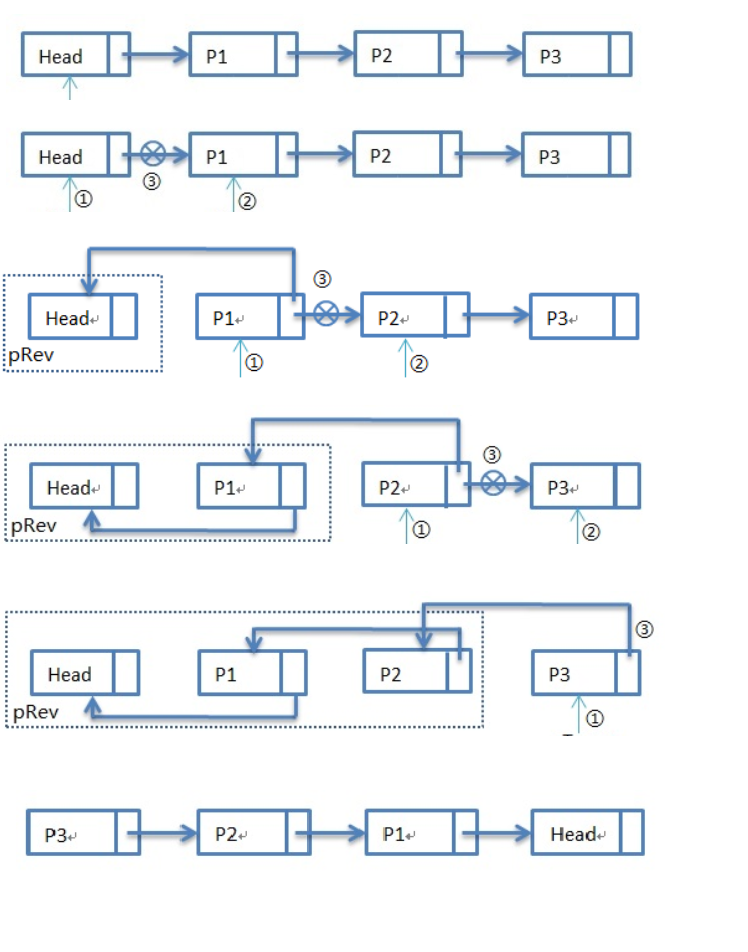
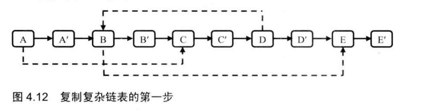
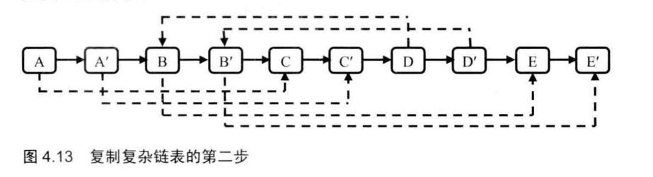
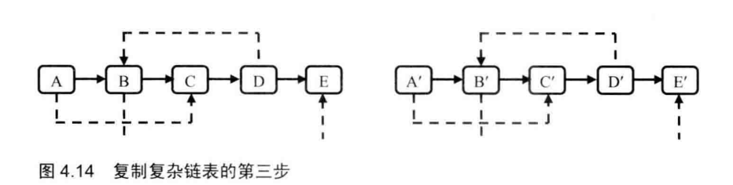
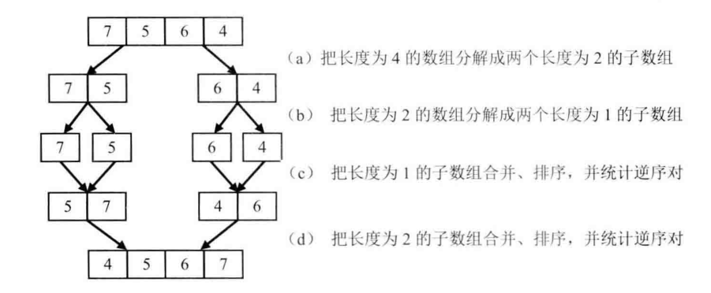
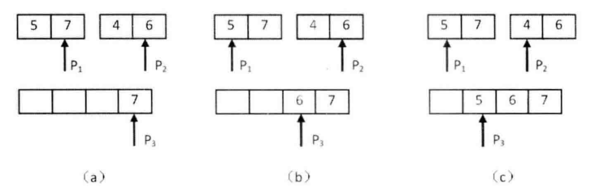
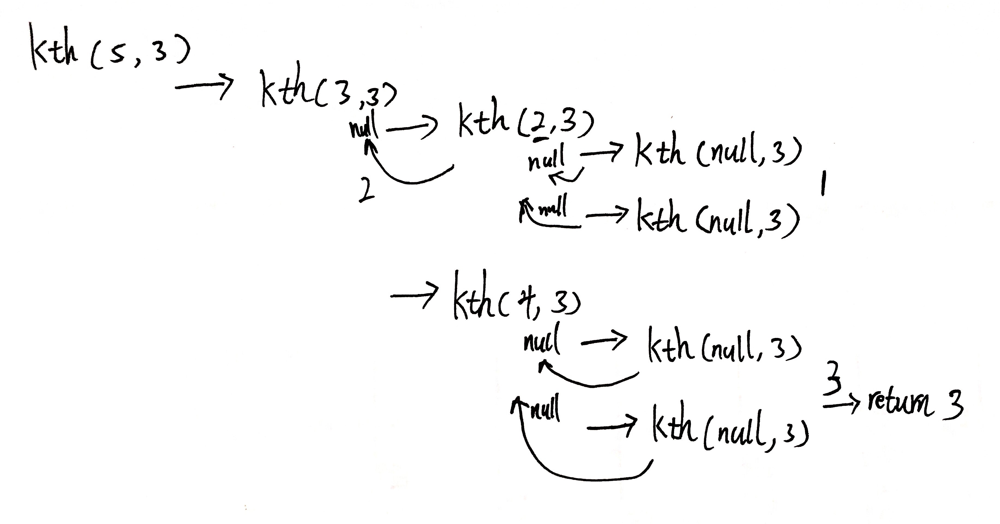
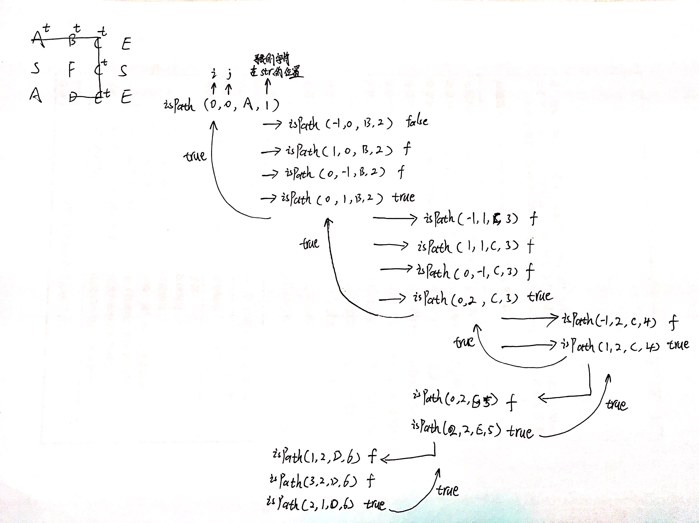

# 	<center>剑指Offer解题思路</center>

- [二维数组中的查找](#二维数组中的查找) 
- [替换空格](#替换空格) 
- [从尾到头打印链表](#从尾到头打印链表) 
- [重建二叉树](#重建二叉树) 
- [用两个栈实现队列](#用两个栈实现队列) 
- [旋转数组的最小数字](#旋转数组的最小数字) 
- [斐波那契数列](#斐波那契数列) 
- [跳台阶](#跳台阶) 
- [二进制中1的个数](#二进制中1的个数) 
- [数值的整数次方](#数值的整数次方) 
- [调整数组顺序使奇数位于偶数前面](#调整数组顺序使奇数位于偶数前面 ) 
- [链表中倒数第k个结点](#链表中倒数第k个结点) 
- [反转链表](#反转链表) 
- [合并两个排序的链表](#合并两个排序的链表) 
- [树的子结构](#树的子结构) 
- [二叉树的镜像](#二叉树的镜像) 
- [顺时针打印矩阵](#顺时针打印矩阵) 
- [包含min函数的栈](#包含min函数的栈) 
- [栈的压入、弹出序列](#栈的压入、弹出序列) 
- [从上往下打印二叉树](#从上往下打印二叉树) 
- [二叉搜索树的后序遍历序列](#二叉搜索树的后序遍历序列) 
- [二叉树中和为某一值的路径](#二叉树中和为某一值的路径) 
- [复杂链表的复制](#复杂链表的复制) 
- [二叉搜索树与双向链表](#二叉搜索树与双向链表) 
- [字符串的排序](#字符串的排序) 
- [数组中出现次数超过一半的数字](#数组中出现次数超过一半的数字) 
- [最小的K个数](#最小的K个数) 
- [连续子数组的最大和](#连续子数组的最大和) 
- [把数组排成最小的数](#把数组排成最小的数) 
- [丑数](#丑数) 
- [第一个只出现一次的字符](#第一个只出现一次的字符) 
- [数组中的逆序对](#数组中的逆序对) 
- [数组中的逆序对](#数组中的逆序对) 
- [两个链表的第一个公共结点](#两个链表的第一个公共结点) 
- [数字在排序数组中出现的次数](#数字在排序数组中出现的次数) 
- [二叉树的深度](#二叉树的深度) 
- [平衡二叉树](#平衡二叉树) 
- [数组中只出现一次的数字](#数组中只出现一次的数字) 
- [和为S的连续正数序列](#和为S的连续正数序列) 
- [和为S的两个数字](#和为S的两个数字) 
- [左旋转字符串](#左旋转字符串) 
- [翻转单词顺序列](#翻转单词顺序列) 
- [扑克牌顺子](#扑克牌顺子) 
- [孩子们的游戏(圆圈中最后剩下的数)](#孩子们的游戏(圆圈中最后剩下的数)) 
- [不用加减乘除做加法](#不用加减乘除做加法) 
- [把字符串转换成整数](#把字符串转换成整数) 
- [数组中重复的数字](#数组中重复的数字) 
- [构建乘积数组](#构建乘积数组) 
- [表示数值的字符串](#表示数值的字符串) 
- [字符流中第一个不重复的字符](#字符流中第一个不重复的字符) 
- [链表中环的入口结点](#链表中环的入口结点) 
- [删除链表中重复的结点](#删除链表中重复的结点) 
- [二叉树的下一个结点](#二叉树的下一个结点) 
- [按之字形顺序打印二叉树](#按之字形顺序打印二叉树) 
- [把二叉树打印成多行](#把二叉树打印成多行) 
- [序列化二叉树](#序列化二叉树) 
- [二叉搜索树的第k个结点](#二叉搜索树的第k个结点) 
- [数据流中的中位数](#数据流中的中位数) 
- [滑动窗口的最大值](#滑动窗口的最大值) 
- [矩阵中的路径](#矩阵中的路径) 
- [机器人的运动范围](#机器人的运动范围) 
- [剪绳子](#剪绳子) 


## 二维数组中的查找

### 题目描述

在一个二维数组中（每个一维数组的长度相同），每一行都按照从左到右递增的顺序排序，每一列都按照从上到下递增的顺序排序。请完成一个函数，输入这样的一个二维数组和一个整数，判断数组中是否含有该整数。

### 解题思路

既然给定了有顺序的数组，那么肯定不会是从头遍历了。可以从左下角考虑，比它小的肯定在其上面，比它大的肯定在其右边，问题解决了。

### 代码

```java
public class Solution {
    public boolean Find(int target, int [][] array) {
        int row = array.length - 1;
        int col = 0;
        while (row >= 0 && col < array[0].length) {
            if (target == array[row][col]) {
                return true;
            } else if (target < array[row][col]) {
                row--;
            } else {
                col++;
            }
        }
        return false;
    }
}
```


---

## 替换空格

### 题目描述

请实现一个函数，将一个字符串中的每个空格替换成 “%20”。例如，当字符串为 We Are Happy. ​ 则经过替换之后的字符串为 We%20Are%20Happy。

### 解题思路

1. 首先遍历字符串，计算共有多少空格，然后扩充字符串的长度。
2. 设置两个指针，头指针指向原始字符串的结尾，尾指针指向扩充后的结尾，从后往前遍历。
3. 若头指针指向字符不是空格，把当前字符放到尾指针指向空间，同时两个指针前移一位；
4. 若头指针指向字符是空格，尾指针前移三次，同时插入 %20，头指针前移一位；
5. 遍历，直至条件结束。

### 代码

```java
public class Solution {
    public String replaceSpace(StringBuffer str) {
        int len = str.length();
        int numspace = 0;
        for (int i = 0; i < len; i++) {
            if (str.charAt(i) == ' ')
                numspace++;
        }
        // 因为空格本身占了一个空间，所以扩充空间为空格数 * 2
        int newlen = len + numspace * 2;
        str.setLength(newlen);
        
        int left = len - 1;
        int right = newlen - 1;
        while (left >= 0 && right > left) {
            if (str.charAt(left) == ' ') {
                str.setCharAt(right--, '0');
                str.setCharAt(right--, '2');
                str.setCharAt(right--, '%');
                left--;
            } else {
                str.setCharAt(right--, str.charAt(left--));
            }
        }
        return str.toString();
    }
}
```


---

## 从尾到头打印链表

### 题目描述

输入一个链表，按链表从尾到头的顺序返回一个ArrayList。

### 解题思路

 

### 代码

```java
public class Solution {
    public ArrayList<Integer> printListFromTailToHead(ListNode listNode) {
        ArrayList<Integer> array = new ArrayList<Integer>();
        if (listNode == null)
            return array;
        ListNode pre = null;
        ListNode next = null;
        while (listNode != null) {
            next = listNode.next;
            listNode.next = pre;
            pre = listNode;
            listNode = next;
        }
        while (pre != null) {
            array.add(pre.val);
            pre = pre.next;
        }
        return array;
    }
}
```


---


## 重建二叉树

### 题目描述

输入某二叉树的前序遍历和中序遍历的结果，请重建出该二叉树。假设输入的前序遍历和中序遍历的结果中都不含重复的数字。例如输入前序遍历序列{1,2,4,7,3,5,6,8}和中序遍历序列{4,7,2,1,5,3,8,6}，则重建二叉树并返回。

### 解题思路

1. 前序遍历的第一位是根节点。
2. 中序遍历中，根节点左右两边分别是左子树和右子树。

### 代码

```java
public class Solution {
	public TreeNode reConstructBinaryTree(int[] pre, int[] in) {
		// 边界条件
		if (pre == null || in == null || pre.length != in.length) {
			return null;
		}
		return construct(pre, 0, pre.length - 1, in, 0, in.length - 1);
	}
	
	public TreeNode construct(int[] pre, int preS, int preE, int[] in, int inS, int inE) {
		if (preS > preE || inS > inE)
			return null;
		// 前序遍历的第一个是根节点,创建根节点
		TreeNode node = new TreeNode(pre[preS]);
		for (int i = inS; i <= inE; i++) {
			// 在中序遍历中寻找根节点
			if (in[i] == pre[preS]) {
				// 递归调用，根据当前根节点构建左子树
				node.left = construct(pre, preS + 1, preS + i - inS, in, inS, i - 1);
				// 递归调用，根据当前根节点构建右子树
				node.right = construct(pre, preS + i - inS + 1, preE, in, i + 1, inE);
			}
		}
		return node;
	}

}
```

---


## 用两个栈实现队列

### 题目描述

用两个栈来实现一个队列，完成队列的Push和Pop操作。 队列中的元素为int类型。

### 解题思路

1. 既然是实现队列，那么就要保证先进去的元素先出来。
2. 可以先讲元素都放入一个栈中，这样所有的元素都是倒序。
3. 将栈中元素都出栈，存入另外一个栈中，这样所有的元素顺序都变成正序了。不过要判断以下另一个栈是否为空，不为空的话，就不用放进去。

### 代码

```java
import java.util.Stack;

public class Solution {
    Stack<Integer> stack1 = new Stack<Integer>();
    Stack<Integer> stack2 = new Stack<Integer>();
    
    public void push(int node) {
        stack1.push(node);
    }
    
    public int pop() {
        if (stack2.empty() && stack1.empty())
            throw new RuntimeException();
        if (stack2.empty()) {
            while (!stack1.empty()) {
                stack2.push(stack1.pop());
            }
        }
        return stack2.pop();
    }
}
```

---


## 旋转数组的最小数字

### 题目描述

把一个数组最开始的若干个元素搬到数组的末尾，我们称之为数组的旋转。输入一个非递减排序的数组的一个旋转，输出旋转数组的最小元素。例如数组 {3,4,5,1,2} 为 {1,2,3,4,5} 的一个旋转，该数组的最小值为 1。
NOTE：给出的所有元素都大于 0，若数组大小为 0，请返回 0。

### 解题思路

1. 旋转数组中有两个非递减排序的数组，可以使用二分查找，从中间开始比较首尾。
2. 若中间数大于等于头数，说明前面的数组仍是非减排序，将头数指针指向中间数，作为新的头数；反之，若中间数小于等于尾数，说明后面的数组仍然是非减排序，将尾数指针指向中间数，作为新的尾数。
3. 当首尾指数相差 1 时，说明到了两个非递减排序的数组的分界点，尾数是分界点。
4. 但是，如果出现像 {1,0,1,1,1} 这种首尾中指针元素都相同的序列时，则需要顺序遍历找到最小值。

### 代码

```java
public class Solution {
    public int minNumberInRotateArray(int [] array) {
        if (array == null)
            return 0;
        int left = 0, right = array.length - 1;
        int mid = 0;
        while (array[left] >= array[right]) {
            if (right - left == 1) {
                mid = right;
                break;
            }
            mid = (left + right) / 2;
            if (array[left] == array[right] && array[mid] == array[left]) {
                int temp = array[left];
                for (int i = left; i <= right; i++) {
                    if (temp > array[i]) {
                        temp = array[i];
                    }
                }
                return temp;
            }
            if (array[mid] >= array[left]) {
                left = mid;
            } else if (array[mid] <= array[right]) {
                right = mid;
            }
        }
        return array[mid];
    }
}
```

---

## 斐波那契数列

### 题目描述

大家都知道斐波那契数列，现在要求输入一个整数n，请你输出斐波那契数列的第n项（从0开始，第0项为0）。

### 解题思路


### 代码

```java
public class Solution {
	// 递归
	public int Fibonacci(int n) {
        if (n == 0)
            return 0;
        if (n == 1)
            return 1;
        return Fibonacci(n - 1) + Fibonacci(n - 2);
    }
	
	// 非递归
	public int Fibonacci1(int n) {
        if (n == 0)
            return 0;
        if (n == 1)
            return 1;
        int f0 = 0;
        int f1 = 1;
        int fn = 0;
        for (int i = 2; i <= n; i++) {
            fn = f0 + f1;
            f0 = f1;
            f1 = fn;
        }
        return fn;
    }
}
```

---


## 跳台阶

### 题目描述

一只青蛙一次可以跳上1级台阶，也可以跳上2级。求该青蛙跳上一个n级的台阶总共有多少种跳法（先后次序不同算不同的结果）。

### 代码

```java
public class Solution {
	
	public int JumpFloor(int target) {
        if(target==1 || target==2)
        		return target;
        return JumpFloor(target-1) + JumpFloor(target-2);
    }
	
	public int JumpFloor2(int target) {
        if(target==1 || target==2)    
        	return target;
        int jumpone = 1, jumptwo = 2;
        while(target-- >= 3){
            jumptwo = jumpone + jumptwo;
            jumpone = jumptwo - jumpone;
        }
        return jumptwo;
    }

}
```

---


## 二进制中1的个数

### 题目描述

输入一个整数，输出该数二进制表示中 *1* 的个数。其中负数用补码表示。

> 考察二进制和位运算。

### 解题思路

代码一：

 　1. 判断整数二进制最右边一位是不是1，然后整体向右移一位，最前面补0，直至整个整数为0。
 　2. 例如整数10的二进制为0000 0000 0000 0000 0000 0000 0000 1010（Java的int类型占用4个字节，即32位）。只看后四位的话，右移一位变成0101，继续右移为0010、0001、0000，可见右移三次整数就变成0。若右移过程中最后一位为1，则记录下来。
 　3. 至于如何判断最后一位是否为1，可以把整数和1进行与操作判断结果是否为1即可。
 　4. 缺点：如果整数是负数，则代码一会报错，因为在对负数进行右移运算时，补的是1，这样会导致死循环。

代码二：

 　1. 优化：让整数和1进行与运算，判断整数的末位是否为1；让1左移，判断倒数第二位是否为1......。例如给定整数10，二进制为1010，和1即二进制0001进行与操作，结果不为1；让1左移一位，即0001变为0010，再和1与操作，结果为1，记录下来......。
 　2. 缺点：整数的二进制有多少个1就要循环多少次。

代码三：

 　1. 若整数的二进制最后一位为1，减1后最后一位变成0。例如1001 - 0001 = 1000。
 　2. 若整数的二进制最后一位不为1，最后那个1是第n位，则减1后第n位的1变成0，之后的0都变为1，之前的不变。例如1100，最右边的1在第2位，减1后：1100 - 0001 = 1011。
 　3. 总结：把整数减1，就是将整数的二进制最右边那个1之后的0都变成1。
 　4. 接着将整数和减1的结果做与运算，作用是将第n位后的1都变成0。例如1100减1后为1011，将1100和1011与运算后为1000。
 　5. 继续使用减1，与运算之后的数进行循环，直至整数变为0。
 　6. 优点：整数的二进制有多少位1就运行多少次。

### 代码

```java
// 代码一
public int NumberOf(int n) {
    int count = 0;
    while(n != 0){
        if((n & 1) == 1){
            count++;
        }
        count = count >> 1;
    }
    return count;
}
```

```java
// 代码二
public int NumberOf(int n) {
    int count = 0;
    int flag = 1;
    while(flag != 0){
        if((n & flag) != 0){
            count++;
        }
        flag = flag << 1;
    }
    return count;
}
```

```java
// 代码三
public int NumberOf(int n) {
    int count = 0;
    while(n != 0){
        count++;
        n = (n - 1) & n;
    }
    return count;
}
```

------


## 数值的整数次方

### 题目描述

给定一个 *double* 类型的浮点数 *base* 和 *int* 类型的整数 *exponent* 。求 *base* 的 *exponent* 次方。

### 解题思路

 1. 首先考虑 *base* 和 *exponent* 的取值范围，如下图所示：

    

 2. 时间复杂度 *O(n)* ：使用 *base* 相乘 *exponent* 次求整数次方。

 3. 时间复杂度 *O(logn)* ：快速幂求解。


### 代码

```java
public class Solution {
    public double Power(double base, int exponent) {
        int index = 0;
        double res = 1;
        if(exponent > 0){
            index = exponent;
        }else if(exponent < 0){
            if(base == 0){
                return -1;
            }
            index = -exponent;
        }else{
            if(base == 0){
                return 0;
            }
            return 1;
        }
        while(index != 0){
            if((index & 1) == 1){
                res *= base;
            }
            base *= base;
            index = index >> 1;
        }
        return exponent>0?res:(1/res);
    }
}
```

------


## 调整数组顺序使奇数位于偶数前面 

### 题目描述

　输入一个整数数组，实现一个函数来调整该数组中数字的顺序，使得所有的奇数位于数组的前半部分，所有的偶数位于数组的后半部分，并保证奇数和奇数，偶数和偶数之间的相对位置不变。

### 解题思路

简单方法：

1. 首先找到第一个偶数，然后从下一个开始遍历数组。
2. 找到偶数后的第一个奇数，按照插入排序，从后往前依次覆盖。
3. 重复以上两步，直至遍历结束。

方法一：利用插入排序的思想。

1. 找到第一个偶数的位置 *p* ，从下一个位置 *p+1* 开始遍历数组。例如 *[1, 2, 3, 4, 5, 6, 7]*，*p = 1* ，从下标 *2* 遍历数组
2. 找到第一个奇数，位置为 *j*，从 *p* 到 *j-1* 的元素依次后移一位，空出位置 *p* 放找到的那个奇数。

方法二：利用冒泡排序的思想。

1. 将最右边的偶数冒泡移到最后一位。
2. 依次将偶数往后移...

### 代码

```java
public void reOrderArray(int [] array) {
    if (array == null)
        return;
    for (int i = 0; i < array.length; i++) {
        if (array[i] % 2 == 0) {
            for (int j = i + 1; j < array.length; j++) {
                if (array[j] % 2 == 0) {
                    continue;
                } else {
                    int temp = array[j];
                    int index = j;
                    while (index > i) {
                        array[index] = array[index - 1];
                        index--;
                    }
                    array[i] = temp;
                    break;
                }
            }
        }
    }
}
```

```java
// 代码一
public void reOrderArray(int [] array) {

    if(array == null || array.length == 0)   return;

    int p = 0;
    for(int i=0; i<array.length; i++){
        if(array[i]%2 == 0){
            p = i;
            break;
        }
    }

    if(p == array.length)   return;

    for(int i=p+1; i<array.length; i++){
        if(array[i] % 2 == 1){
            int j = i;
            int temp = array[j];
            while(j > p){
                array[j] = array[j-1];
                j--;
            }
            array[p] = temp;
            p++;
        }	    
    }
}
```

```java
// 代码二
public void reOrderArray(int [] array) {
    for(int i=0; i<array.length-1; i++){
        for(int j=0; j<array.length-1-i; j++){
            if(array[j]%2==0 && array[j+1]%2==1){
                int temp = array[j];
                array[j] = array[j+1];
                array[j+1] = temp;
            }
        }
    }
}
```

------


## 链表中倒数第k个结点

### 题目描述

输入一个链表，输出该链表中倒数第k个结点。

### 解题思路

方法一：

1. 倒数第 k 个结点，就是正数第 n-k+1 个。
2. 若设置一个快指针先行遍历到链表的最后，那么倒数第 k 个结点与最后一个结点的距离相差 n - (n-k+1) = k - 1
3. 所以，可以让快指针线性走 k-1 步，此时，设置一个慢指针与快指针同时前进；当快指针走到最后，慢指针刚好走 k-1 步，即倒数第 k 个结点。

### 代码

```java
public class Solution {
    public ListNode FindKthToTail(ListNode head, int k) {
        if (head == null || k <= 0)
            return null;
        ListNode slow = head;
        ListNode fast = head;
        for (int i = 0; i <k - 1; i++) {
            if (fast.next != null) {
                fast = fast.next;
            } else {
                return null;
            }
        }
        while (fast.next != null) {
            fast = fast.next;
            slow = slow.next;
        }
        return slow;
    }
}
```

---


## 反转链表

### 题目描述

输入一个链表，反转链表后，输出新链表的表头。

### 代码

```java
public class Solution {
    public ListNode ReverseList(ListNode head) {
        if (head == null)
            return null;
        ListNode pre = null, next = null;
        while (head != null) {
            next = head.next;
            head.next = pre;
            pre = head;
            head = next;
        }
        return pre;
    }
}
```

---


## 合并两个排序的链表

### 题目描述

输入两个单调递增的链表，输出两个链表合成后的链表，当然我们需要合成后的链表满足单调不减规则。

### 代码

```jaa
// 非递归
public ListNode Merge(ListNode list1,ListNode list2) {
    if (list1 == null && list2 == null)
        return null;
    if (list1 == null)
        return list2;
    if (list2 == null)
        return list1;

    ListNode head = null, cur = null;
    while (list1 != null && list2 != null) {
        if (list1.val <= list2.val) {
            if (head == null) {
                head = cur =  list1;
            } else {
                cur.next = list1;
                cur = cur.next;
            }
            list1 = list1.next;
        } else {
            if (head == null) {
                head = cur = list2;
            } else {
                cur.next = list2;
                cur = cur.next;
            }
            list2 = list2.next;
        }
    }

    if (list1 == null)
        cur.next = list2;
    if (list2 == null)
        cur.next = list1;
    return head;
}

//递归
public ListNode Merge(ListNode list1,ListNode list2) {
    if (list1 == null && list2 == null)
        return null;
    if (list1 == null)
        return list2;
    if (list2 == null)
        return list1;

    ListNode head = null;
    if (list1.val <= list2.val) {
        head = list1;
        head.next = Merge(list1.next, list2);
    } else {
        head = list2;
        head.next = Merge(list1, list2.next);
    }
    return head;
}
```

---


## 树的子结构

### 题目描述

输入两棵二叉树A，B，判断B是不是A的子结构。（ps：我们约定空树不是任意一个树的子结构）

### 解题思路

1. 找到二叉树A中对应二叉树B的根节点相同的节点。
2. 递归的判断A和B的左子树和右子树是否相同。

### 代码

```java

public class Solution {
	
	public boolean HasSubtree(TreeNode root1,TreeNode root2) {
		boolean res = false;
        // 若A、B皆为空树时，返回false
        if (root1 != null && root2 != null) {
            // 找到A树中与B树根节点相对应的节点
			if (root1.val == root2.val) {
				res = Tree1haveTree2(root1, root2);	
			}
            // 若没有，继续从A树的左右子树中寻找
			if (!res) {
				res = Tree1haveTree2(root1.left, root2);
			}
			if (!res) {
				res = Tree1haveTree2(root1.right, root2);
			}
		}
        return res;
    }

	public boolean Tree1haveTree2(TreeNode root1, TreeNode root2) {
        // 下面两个判断条件不能互换的
        // B树完美的遍历完，返回true
		if (root2 == null) {
			return true;
		}
        // 到这里时B树还没遍历完，A树就遍历完了，返回false
		if (root1 == null) {
			return false;
		}
        // A树和B树没有对应上，返回false
		if (root2.val != root1.val) {
			return false;
		}
        // 判断A树的左右节点是否仍和B树相对应
		return Tree1haveTree2(root1.left, root2.left) && Tree1haveTree2(root1.right, root2.right);
	}
}
```


---


## 二叉树的镜像

### 题目描述

操作给定的二叉树，将其变换为源二叉树的镜像。

```
二叉树的镜像定义：源二叉树 
    	    8
    	   /  \
    	  6   10
    	 / \  / \
    	5  7 9 11
    	镜像二叉树
    	    8
    	   /  \
    	  10   6
    	 / \  / \
    	11 9 7  5
```

### 解题思路

交换当前结点的左右结点后，整个左右子树也是交换了的，见下图：


### 代码

```java
// 递归
public void Mirror(TreeNode root) {
    if (root == null)	return;
    if (root.left == null && root.right == null)	return;
    // 交换当前结点的左右子树
    TreeNode tempNode = root.left;
    root.left = root.right;
    root.right = tempNode;
    if (root.left != null) {
        Mirror(root.left);
    }
    if (root.right != null) {
        Mirror(root.right);
    }
}

// 非递归
public void Mirror(TreeNode root) {
    if (root == null)	return;
    if (root.left == null && root.right == null)	return;
    Stack<TreeNode> stack = new Stack<>();
    // 先将根结点压人栈中
    stack.push(root);
    while(!stack.isEmpty()) {
        // 取出栈顶元素，即当前的根结点
        TreeNode node = stack.pop();
        // 交换左右子树
        if (node.left != null || node.right != null) {
            TreeNode tempNode = node.left;
            node.left = node.right;
            node.right = tempNode;
        }
        // 若当前结点有左结点，压人栈中
        if (node.left != null) {
            stack.push(node.left);
        }
        // 若当前结点有右结点，压人栈中
        if (node.right != null) {
            stack.push(node.right);
        }
    }
}
```

---


## 顺时针打印矩阵

---


## 包含min函数的栈

### 题目描述

　定义栈的数据结构，请在该类型中实现一个能够得到栈中所含最小元素的 $min$ 函数（时间复杂度应为 $O(1)$）。

### 解题思路

 1. 定义一个辅助栈，用来存储当前栈中最小的数。

 2. 将数据压入栈中时，比较当前数据和辅助栈栈顶元素大小。

 3. 若栈顶元素大，则把当前数据压入辅助栈中；反之，再次压入栈顶元素。

 4. 例如入栈元素为：*7 4 5 9 2 3 1 4*

    辅助栈中元素为：*7 4 4 4 2 2 1 1*

### 代码

```java
import java.util.Stack;
public class Solution {
    Stack<Integer> s1 = new Stack<Integer>();
    Stack<Integer> s2 = new Stack<Integer>();
    
    public void push(int node) {
        s1.push(node);
        if (s2.empty()) {
            s2.push(node);
        } else if (s2.peek() >= node) {
            s2.push(node);
        }
    }
    
    public void pop() {
        if (s1.peek() == s2.peek()) {
            s2.pop();
        }
        s1.pop();
    }
    
    public int top() {
        return stack1.peek();
    }
    
    public int min() {
        return stack2.peek();
    }
}
```


------


## 栈的压入、弹出序列

### 题目描述

　输入两个整数序列，第一个序列表示栈的压入顺序，请判断第二个序列是否可能为该栈的弹出顺序。假设压入栈的所有数字均不相等。例如序列 *1,2,3,4,5* 是某栈的压入顺序，序列 *4,5,3,2,1* 是该压栈序列对应的一个弹出序列，但 *4,3,5,1,2* 就不可能是该压栈序列的弹出序列。（注意：这两个序列的长度是相等的）。

### 解题思路

 　1. 借助一个辅助栈，将第一个序列的元素挨个压入栈中；
 　2. 压入栈中的同时和第二个序列进行比较，若相同则弹出，反之继续压入；
 　3. 当与第二个序列比较完毕后，若栈空则第二个序列是第一个序列的弹出顺序，反之不是。

### 代码

```java
import java.util.ArrayList;
import java.util.Stack;

public boolean IsPopOrder(int [] pushA,int [] popA) {
    if (pushA == null || popA == null)
        return false;
    int index = 0;
    Stack<Integer> s = new Stack<Integer>();
    for (int i = 0; i < pushA.length; i++) {
        s.push(pushA[i]);
        while (!s.empty() && s.peek() == popA[index]) {
            s.pop();
            index++;
        }
    }
    return s.empty();
}
```


------

## 从上往下打印二叉树

### 题目描述

从上往下打印出二叉树的每个节点，同层节点从左至右打印。

    	    8
    	   /  \
    	  6   10
    	 / \  / \
    	5  7 9 11
### 解题思路

1. 这是二叉树的层序遍历呀。
2. 设置一个队列，从根结点开始入队，将其左右结点6和8入队。
3. 按照层次，将6出队，把其左右结点5和7再入队，...。

### 代码

```java
import java.util.ArrayList;
import java.util.LinkedList;
import java.util.Queue;

public ArrayList<Integer> PrintFromTopToBottom(TreeNode root) {
    ArrayList<Integer> list = new ArrayList<>();
    if (root == null) {
        return list;
    }
    Queue<TreeNode> queue = new LinkedList<>();
    queue.add(root);
    while(!queue.isEmpty()) {
        TreeNode node = queue.poll();
        list.add(node.val);
        if (node.left != null) {
            queue.add(node.left);
        }
        if (node.right != null) {
            queue.add(node.right);
        }
    }
    return list;
}
```


---

## 二叉搜索树的后序遍历序列

### 题目描述

输入一个整数数组，判断该数组是不是某二叉搜索树的后序遍历的结果。如果是则输出Yes,否则输出No。假设输入的数组的任意两个数字都互不相同。

	    8
	   /  \
	  6   10
	 / \  / \
	5  7 9 11
	
	后序遍历：5 7 6 9 11 10 8
### 解题思路

1. 二叉搜索树每个结点的左子树都比它小，右子树都比它大。
2. 后序遍历的最后一个是根结点。
3. 遍历数组，找到第一个大于根结点的数，该数左边为左子树，右边为右子树。
4. 若该数右边还有小于根结点的数，则不是一个后序遍历。
5. 依次对左边和右边进行2-4的操作。

### 代码

```java
public boolean VerifySquenceOfBST(int [] sequence) {
    if (sequence.length == 0) {
        return false;
    }
    return midSearch(sequence, 0, sequence.length-1);
}

public boolean midSearch(int[] sequence, int left, int right) {
    if (left >= right) {
        return true;
    }
    int i = left;
    while (sequence[i] < sequence[right]) {
        i++;
    }
    for (int j = i; j < right; j++) {
        if (sequence[j] < sequence[right]) {
            return false;
        }
    }
    return midSearch(sequence, left, i - 1) && midSearch(sequence, i + 1, right - 1);
}
```


---

## 二叉树中和为某一值的路径

### 题目描述

输入一颗二叉树的跟节点和一个整数，打印出二叉树中结点值的和为输入整数的所有路径。路径定义为**从树的根结点开始往下一直到叶结点**所经过的结点形成一条路径。(注意: 在返回值的list中，数组长度大的数组靠前)

### 解题思路

        10
       /  \
      9    3
          / \
         8   6
    targrt：19
使用递归遍历二叉树。

遍历过程：


### 代码

```java
import java.util.ArrayList;
/**
public class TreeNode {
    int val = 0;
    TreeNode left = null;
    TreeNode right = null;

    public TreeNode(int val) {
        this.val = val;
    }
}
*/
public class Solution {
    // 放在函数外，防止递归时把原来的值覆盖
    // 存放所有的路径
    ArrayList<ArrayList<Integer>> listAll = new ArrayList<ArrayList<Integer>>();
    // 存放当前寻找的路径
	ArrayList<Integer> list = new ArrayList<>();
    
    public ArrayList<ArrayList<Integer>> FindPath(TreeNode root,int target) {
        if (root == null)	return listAll;
        list.add(root.val);
        target -= root.val;
        // 满足到达叶子结点
        if ((target == 0) && root.left == null && root.right == null) {
        	int listCount = 0;
            // 按照数组长度放入listAll中
        	while (listCount < listAll.size() && list.size() < listAll.get(listCount).size()) {
        		listCount++;
        	}
			listAll.add(listCount, new ArrayList<Integer>(list));
		}
        FindPath(root.left, target);
        FindPath(root.right, target);
        // 若已经到达叶子结点还不满足条件，将当前的叶子结点去掉，递归返回上一层。
        list.remove(list.size()-1);
        return listAll;
    }
}
```


---

## 复杂链表的复制

### 题目描述

输入一个复杂链表（每个节点中有节点值，以及两个指针，一个指向下一个节点，另一个特殊指针指向任意一个节点），返回结果为复制后复杂链表的head。（注意，输出结果中请不要返回参数中的节点引用，否则判题程序会直接返回空）

### 解题思路

思路一：

1. 遍历链表，同时新建一个一样链表，这样两个链表有相同的 *next* 指针。
2. 遍历链表的同时，将每个元素的 *random* 指向元素存入一个哈希表。
3. 在新链表中，为每个元素都遍历一遍链表建立 *random* 指针。
4. 问题：若链表中有相同的元素，则方法失败。

思路二：

1. 在旧链表中的每个元素后面复制该元素。

   

2. 给每个复制的元素添加 *random* 指针。

   

3. 把新旧链表分开。

    

### 代码

```java
// 思路二
public RandomListNode Clone(RandomListNode pHead) {
    // 为空链，返回null
    if (pHead == null) {
        return null;
    }
    // 创建当前链表第一个节点的引用
    RandomListNode node = pHead;
    // 复制next，A->B->C => A->A'->B->B'->C->C'
    while (node != null) {
        RandomListNode temp = new RandomListNode(node.label);
        temp.next = node.next;
        node.next = temp;
        node = temp.next;
    }
    // 重新变为第一个节点的引用
    node = pHead;
    // 复制链表random指针
    while (node != null) {
        // 有的节点random指针为空
        if (node.random != null) {
            // 若A指向C，则A‘必然指向C后面的C’
            node.next.random = node.random.next;
        }
        // 往后跳一个，比如A后面是它的复制值A‘，再后面一个才是B
        node = node.next.next;
    }
    // 重新变为新链表的头结点，即最终要返回的
    node = pHead.next;
    // 旧链表、新链表头节点的引用
    RandomListNode oldnode = pHead, newnode = node;
    // 因为已经排除了是空链表，所以先将旧链表的头结点指向旧链表的第二个节点
    oldnode.next = newnode.next;
    // 重新定位旧链表结点, 这样旧链表结点始终在最后的位置。若不为空，则后面肯定有一个新链表的结点
    oldnode = oldnode.next;
	// 拆开链表
    while (oldnode != null) {
        newnode.next = oldnode.next;
        newnode = newnode.next;
        oldnode.next = newnode.next;
        oldnode = oldnode.next;
    }
    return node;
}
```

---


## 二叉搜索树与双向链表

### 题目描述

输入一棵二叉搜索树，将该二叉搜索树转换成一个排序的双向链表。要求不能创建任何新的结点，只能调整树中结点指针的指向。

### 解题思路

二叉搜索树，左结点都小于根结点，右结点都大于根节点。

排序的链表就是中序遍历一下而已。

         10
        /  \
       5    16
       \    / \
        8  12  25
1. 满足条件 *pRootOfTree != null* ，将 10 16 25 按顺序入栈
2. 链表第一位 *pRootOfTree = 25* 出栈，给其一个引用 *pre* 
3. *pRootOfTree* 指向其左子树，但是为空
4.  *pRootOfTree = 16* 出栈，和 *25* 连接，此时链表为：16 25
5. *pRootOfTree* 指向其左子树，值为 12
6. 满足条件 *pRootOfTree != null* ，将 12 入栈，此时栈：10 12
7. *pRootOfTree = 12* 出栈，和 16 连接，此时链表为：12 16 25
8. *pRootOfTree* 指向其左子树，值为空
9. *pRootOfTree = 10* 出栈，和 12 连接，此时链表为：10 12 16 25
10. *pRootOfTree* 指向其左子树，值为 5
11. 满足条件 *pRootOfTree != null* ，将 5 和它的右子树入栈，此时栈：5 8
12. *pRootOfTree = 8* 出栈，和 10 连接，此时链表为：8 10 12 16 25
13. *pRootOfTree* 指向其左子树，值为空
14. *pRootOfTree = 5* 出栈，和 8 连接，此时链表为：5 8 10 12 16 25
15. *pRootOfTree* 指向其左子树，值为空，同时栈也为空，返回 *pre*

### 代码

```java
// 代码一   非递归：右 中 左
import java.util.Stack;

public TreeNode Convert(TreeNode pRootOfTree) {
    if (pRootOfTree == null) {
        return null;
    }
    Stack<TreeNode> stack = new Stack<>();
    TreeNode pre = null;
    // 
    while (pRootOfTree != null || !stack.isEmpty()) {
        // 若当前结点不为空，将该结点以及右结点压入栈中
        while (pRootOfTree != null) {
            stack.push(pRootOfTree);
            pRootOfTree = pRootOfTree.right;
        }
        // 得到当前结点
        pRootOfTree = stack.pop();
        // 给最大的值，即当前的头结点附一个引用pre
        if (pre == null) {
            pre = pRootOfTree;
        }else {
            // 将两个结点串在一块，同时pre向前走一位，作为当前第一个结点的引用
            pRootOfTree.right = pre;
            pre.left = pRootOfTree;
            pre = pRootOfTree;
        }
        // 防止当前结点还有左子树
        // 若有，则在下一次循环中将其左子树的根节点以及左子树的根节点的所有右结点压入栈中
        pRootOfTree = pRootOfTree.left;
    }
    return pre;
}
```

```java
// 代码二 	非递归：左 中 右
// 需要多存储一个头结点变量
import java.util.Stack;

public TreeNode Convert(TreeNode pRootOfTree) {
    if (pRootOfTree == null) {
        return null;
    }
    TreeNode pre = null;
    TreeNode newNode = null;
    Stack<TreeNode> stack = new Stack<>();
    while (pRootOfTree != null || !stack.isEmpty()) {
        while (pRootOfTree != null) {
            stack.push(pRootOfTree);
            pRootOfTree = pRootOfTree.left;
        }
        pRootOfTree = stack.pop();
        if (pre == null) {
            pre = pRootOfTree;
            newNode = pRootOfTree;
        }else {
            pRootOfTree.left = pre;
            pre.right = pRootOfTree;
            pre = pRootOfTree;
        }
        pRootOfTree = pRootOfTree.right;
    }
    return newNode;
}
```

```java
// 代码三 递归：右 中 左
TreeNode pre = null;
public TreeNode Convert(TreeNode pRootOfTree) {
    if (pRootOfTree == null) {
        return pRootOfTree;
    }
    Convert(pRootOfTree.right);
    if (pre == null) {
        pre = pRootOfTree;
    }else {
        pre.left = pRootOfTree;
        pRootOfTree.right = pre;
        pre = pRootOfTree;
    }
    Convert(pRootOfTree.left);
    return pre;
}
```

---


## 字符串的排序

### 题目描述

 　输入一个字符串,按字典序打印出该字符串中字符的所有排列。例如输入字符串abc,则打印出由字符a,b,c所能排列出来的所有字符串 *abc,acb,bac,bca,cab* 和 *cba* 。

### 解题思路

​	依次将每个字符交换到最前面，之后按相同的方式排列剩下的字符。如下图所示：


### 代码

```java

import java.util.ArrayList;
import java.util.Collections;
public class Solution{

    public ArrayList<String> Permutation(String str) {
        ArrayList<String> list = new ArrayList<String>();
        if(str!=null){
            strPermutation(str.toCharArray(), 0, list);
            Collections.sort(list);
        }
        return list;
    }
    public void strPermutation(char[] ch, int k, ArrayList<String> list){
        if(k == ch.length-1){
            if(!list.contains(String.valueOf(ch))){
                list.add(String.valueOf(ch));
            }
        }else{
            for(int j=k; j<ch.length; j++){
                swap(ch, k, j);
                strPermutation(ch, k+1, list);
                swap(ch, k, j);
            }
        }
    }
    public void swap(char[] ch, int k, int j){
        if(k!=j){
         	char temp = ch[k];
        	ch[k] = ch[j];
        	ch[j] = temp;   
        }
    }
}
```


------


## 数组中出现次数超过一半的数字

### 题目描述

　数组中有一个数字出现的次数超过数组长度的一半，请找出这个数字。例如输入一个长度为9的数组{1,2,3,2,2,2,5,4,2}。由于数字2在数组中出现了5次，超过数组长度的一半，因此输出2。如果不存在则输出0。

### 解题思路

方法一：

1. 若数组中有出现次数超过一半的数字，那么该数字出现的次数肯定比剩下所有的数出现的次数之和还要大；
2. 设两个变量，*res* 表示数字，*index* 表示数字 *res* 出现的次数；
3. 循环数组，若出现的数字保存的数字相同，次数加 *1* ，不同则减 *1* ；
4. 最后将 *index* 置为 *1* 的数字 *res* 就是可能就是出现次数最多的那个数字。
5. 判断该数字出现次数是否大于数组长度的一半。

方法二：

1. 若数组中有出现次数超过一半的数字，那么经过排序后，数组的中位数肯定是该数字，所以先找到排好序的中位数；
2. 使用快排，每一次快排后，总会有一个数，其左边左右的数都比它小，右边的都比它大，返回其下标；
3. 若该数所在下标刚好等于 *n / 2* ，则该数即为中位数；若大于 *n / 2* ，则中位数在该数的左侧；反之，则在右侧；
4. 经过多次快排，得到中位数，然后遍历数组，判断该数字出现次数是否大于数组长度的一半。

### 代码

```java
// 代码一
public int MoreThanHalfNum_Solution(int [] array) {
    if(array.length <= 0)   return 0;
    int index = 1, res = array[0];
    for(int i=1; i<array.length; i++){
        if(index == 0){
            res = array[i];
            index = 1;
        }
        if(array[i] == res){
            index++;
        }else{
            index--;
        }
        
    }
    int count = 0;
    for(int i=0; i<array.length; i++){
        if(array[i] == res)     count++;
    }
    if(count <= array.length/2){
        return 0;
    }
    return res;
}
```

```java
// 代码二
public int MoreThanHalfNum_Solution(int [] array) {
        if(array.length <= 0)   return 0;
        int middle = array.length >> 1;
        int left = 0, right = array.length - 1;
        int index = headAndTailPartion(array, left, right);
        while(index != middle){
            if(index < middle){
                index = headAndTailPartion(array, index+1, right);
            }else{
                index = headAndTailPartion(array, index, index-1);
            }
        }
        
        int res = array[index];
        int count = 0;
        for(int i=0; i<array.length; i++){
            if(array[i] == res)     count++;
        }
        if(count <= array.length/2){
            return 0;
        }
        return res;
    }
    
    public int headAndTailPartion(int[] array, int left, int right){
        int pivot = array[left];
        while(left < right){
            while(left < right && array[right] > pivot){
                right--;
            }
            while(left < right && array[left] < pivot){
                left++;
            }
            if(left < right){
                swap(array[left], array[right]);
                left++;
                right--;
            }
        }
        swap(pivot, array[right]);
        return right;
    }
    
    public static void swap(int aleft, int aright){
        int temp = aleft;
        aleft = aright;
        aright = temp; 
    }
```

---


## 最小的K个数

### 题目描述

输入n个整数，找出其中最小的K个数。例如输入4,5,1,6,2,7,3,8这8个数字，则最小的4个数字是1,2,3,4。》

> > 主要考察堆

### 解题思路

方法一：

1. 冒泡排序：每次将最小的数咕噜咕噜到最后面
2. 咕噜 K 次，最后面的 K 个数就是要求的

方法二：

1. 将 K 个数放入数组中，第一个是这 K 个数中最小的
2. 将剩下的数依次和第一个比较，若该数小，则替换数组中第一个元素，并将该数放入正确的位置

方法三：

1. 使用大顶堆替代数组来保存 K 个数，那么堆顶就是 K 个数的最大值
2. 将剩下的数依次和堆顶比较，若该数小，则替换堆顶，重新调整

### 代码

```java
// 方法三
// 建大顶堆
public static void creatHeap(int[] arr, int n) {
    for (int i = (n - 1) / 2; i >= 0; i--) {
        percolateDown(arr, i, n);
    }
}
// 删除栈顶元素并调整
private static void deleteHeap(int[] arr, int data, int n) {
    arr[0] = data;
    percolateDown(arr, 0, n);
}
// 下滤
private static void percolateDown(int[] arr, int i, int n) {
    // 第一个叶子结点的父结点
    int fatherdata = arr[i];
    // 该父结点左孩子的索引
    int child = 2 * i + 1;
    while (child <= n) {
        // 判断左孩子和右孩子较大的那个
        if (child + 1 <= n && arr[child + 1] > arr[child]) {
            child += 1;
        }
        // 若父结点比孩子结点都大，直接跳出
        if (fatherdata > arr[child]) {
            break;
        }
        // 调整父结点和子结点
        arr[i] = arr[child];
        arr[child] = fatherdata;
        i = child;
        child = i * 2 + 1;
    }
}
public static ArrayList<Integer> GetLeastNumbers_Solution(int[] input, int k) {
    ArrayList<Integer> list = new ArrayList<Integer>();
    if (input == null || input.length < k) {
        return list;
    }
    creatHeap(input, k - 1);
    for (int i = k; i < input.length; i++) {
        // 是否比堆顶元素大
        if (input[i] < input[0]) {
            deleteHeap(input, input[i], k - 1);
        }
    }
    for (int i = 0; i < k; i++) {
        list.add(input[i]);
    }
    return list;
}

// 或者
// 使用优先级队列 PriorityQueue 代替手工建堆
public ArrayList<Integer> GetLeastNumbers_Solution(int [] input, int k) {
    ArrayList<Integer> list = new ArrayList<Integer>();
    if (input.length == 0 || k <= 0 || k > input.length) {
        return list;
    }
    PriorityQueue<Integer> queue = new PriorityQueue<Integer>();
    for (int i = 0; i < input.length; i++) {
        queue.offer(input[i]);
    }
    for (int i = 0; i < k; i++) {
        list.add(queue.poll());
    }
    return list;
}
```

---


## 连续子数组的最大和

### 题目描述

HZ偶尔会拿些专业问题来忽悠那些非计算机专业的同学。今天测试组开完会后,他又发话了:在古老的一维模式识别中,常常需要计算连续子向量的最大和,当向量全为正数的时候,问题很好解决。但是,如果向量中包含负数,是否应该包含某个负数,并期望旁边的正数会弥补它呢？例如:{6,-3,-2,7,-15,1,2,2},连续子向量的最大和为8(从第0个开始,到第3个为止)。给一个数组，返回它的最大连续子序列的和，你会不会被他忽悠住？(子向量的长度至少是1)

> 最大子序和问题

### 解题思路

方法一：

1. 设置两个变量： *maxsum* 保存最大值，*thissum* 保存到当前数字为止的累加和
2. 若 *thissum* 为正，则继续累加

方法二：

1. 动态规划的思想：每次比较当前数 和 当前数字与其之前最大累加和的和
2. 公式：$ f(x) = max(array[i], f(i-1) + array[i]) $

### 代码

```java
// 代码一
public int FindGreatestSumOfSubArray(int[] array) {
    int maxsum = array[0], thissum = array[0];
    for (int i = 1; i < array.length; i++) {
        thissum = thissum < 0 ? array[i] : thissum + array[i];
        maxsum = thissum > maxsum ? thissum : maxsum;
    }
    return maxsum;
}
```

```java
// 代码二
public int FindGreatestSumOfSubArray(int[] array) {
    int maxsum = array[0], thissum = array[0];
    for (int i = 1; i < array.length; i++) {
        thissum = Math.max(array[i], thissum + array[i]);
        maxsum = Math.max(maxsum, thissum);
    }
    return maxsum;
}
```

---


## 把数组排成最小的数

### 题目描述

输入一个正整数数组，把数组里所有数字拼接起来排成一个数，打印能拼接出的所有数字中最小的一个。例如输入数组{3，32，321}，则打印出这三个数字能排成的最小数字为321323。

### 解题思路

方法一：

1. 参考字符串的排序，对数组进行全排列
2. 然后选出最小的那个
3. *n* 个数字共有 n！个排列，时间复杂度太高

方法二：

1. 若 ab > ba ，说明 b 应该放在 a 的前面，比如 5，31
2. 根据这个规则，可以使用冒泡排序，对数字两两比较，将该放在后面的 b 咕噜到最后一位。比如 5，31，4。5肯定是放在最后一位的
3. 每次咕噜一个最大的到数组后面，最后将数组转换为字符串

### 代码

```java
// 方法二
import java.util.ArrayList;
import java.math.BigInteger;
public class Solution {
    public String PrintMinNumber(int [] numbers) {
        if (numbers.length == 0) return "";
        String str = "";
        for (int i = 0; i < numbers.length - 1; i++) {
			for (int j = 0; j < numbers.length - i - 1; j++) {
                // 给定的数字可能超出Integer的最大范围
				BigInteger a = new BigInteger(numbers[j] + "" + numbers[j + 1]);
				BigInteger ra = new BigInteger(numbers[j + 1] + "" + numbers[j]);
                // 若数组 ab > ba，将 a 和 b 互换
				if (a.compareTo(ra) == 1) {
					int temp = numbers[j];
					numbers[j] = numbers[j + 1];
					numbers[j + 1] = temp;
				}
			}
		}
        for (int i = 0; i < numbers.length; i++) {
			str += String.valueOf(numbers[i]);
		}
        return str;
    }
}
```

---


## 丑数

### 题目描述

把只包含质因子2、3和5的数称作丑数（Ugly Number）。例如6、8都是丑数，但14不是，因为它包含质因子7。 习惯上我们把1当做是第一个丑数。求按从小到大的顺序的第N个丑数。

### 解题思路

方法一：

1. 丑数最后肯定能被 2，3，5 这三个数整除
2. 暴力从 1 开始解决，缺点是不是丑数的数字也会进行计算。提交显示超时

方法二：


> 借用一位牛友的回答 -> [点此查看原回答](<https://www.nowcoder.com/questionTerminal/6aa9e04fc3794f68acf8778237ba065b?toCommentId=1314313>) 

### 代码

```java
// 方法一
public class Solution {
    public static int GetUglyNumber_Solution(int index) {
    	if (index <= 0)
    		return 0;
    	int count = 0, number = 0;
    	while (count < index) {
    		number++;
    		if (isUgly(number)) {
    			count++;
    		}
    	}
    	System.out.println(number);
        return number;
    }
    
    private static boolean isUgly(int number) {
    	while (number % 2 == 0) {
    		number /= 2;
    	}
    	while (number % 3 == 0) {
    		number /= 3;
    	}
    	while (number % 5 == 0) {
    		number /= 5;
    	}
    	return (number == 1) ? true : false;
	}
    
}

```

```java
// 方法二
public class Solution {
	public int GetUglyNumber_Solution(int index) {
		if (index <= 0)
    		return 0;
		int[] res = new int[index];
		res[0] = 1;
		int l1 = 0, l2 = 0, l3 = 0;
		for (int i = 1; i < index; i++) {
			res[i] = findMin(res[l1] * 2, res[l2] * 3, res[l3] * 5);
			if (res[i] == res[l1] * 2)
				l1++;
			if (res[i] == res[l2] * 3)
				l2++;
			if (res[i] == res[l3] * 5)
				l3++;
		}
		System.out.println(res[index - 1]);
		return res[index - 1];
    }
    
    
	private int findMin(int i, int j, int k) {
		int min = Math.min(i, j);
		return Math.min(min, k);
	}
    
}
```

---


## 第一个只出现一次的字符

### 题目描述

在一个字符串 (0<=字符串长度<=10000，全部由字母组成) 中找到第一个只出现一次的字符,并返回它的位置, 如果没有则返回 -1（需要区分大小写）.

### 解题思路

1. 使用哈希表存储字母，每次出现值就加 1
2. 遍历字符串，并从哈希表中取出其 value ，如果是 1 ，返回位置

### 代码

```java
import java.util.HashMap;
public class Solution {
    public int FirstNotRepeatingChar(String str) {
        HashMap<Character, Integer> map = new HashMap<Character, Integer>();
		for (int i = 0; i < str.length(); i++) {
			char key = str.charAt(i);
			if (!map.containsKey(key)) {
				map.put(key, 1);
			}else {
				int count = map.get(key);
				map.put(key, ++count);
			}
		}
		int pos = -1;
		for (int i = 0; i < str.length(); i++) {
			if (map.get(str.charAt(i)) == 1)	
				return i;
		}
        return pos;
    }
}
```

---


## 数组中的逆序对

### 题目描述

在数组中的两个数字，如果前面一个数字大于后面的数字，则这两个数字组成一个逆序对。输入一个数组,求出这个数组中的逆序对的总数P。并将P对1000000007取模的结果输出。 即输出P%1000000007

### 解题思路

方法一：

1. 遍历数组，对每个数都与其后面的数比较
2. 时间复杂度 \[O(n^2)\] ，超时未通过

方法二：

1. 利用归并排序的方法，把数组分解位两个数组，每次只考虑这两个数组的情况，同时在辅助数组中按照大小排序，通过递归的方法处理，最后肯定是先从一位一位排好序的。

    

2. 两两数组排序到辅助数组中时，设置两个指针同时指向两个数组的最后一位，如图a所示，此时两个数组都是从大到小排好序的。

    

3. 若 p1 指向元素大于 p2 指向元素，说明 p1 与 第二个数组中的所有元素皆可组成逆序对，同时将 p1 元素放置辅助数组中，往前移动 p1；否则的话将 p2 往前移，继续比较。

### 代码

```java
// 方法一  不通过
private static int InversePairs(int[] array) {
    int P = 0;
    for (int i = 0; i < array.length - 1; i++) {
        for (int j = i + 1; j < array.length; j++) {
            if (array[i] > array[j]) {
                P++;
            }
        }
    }
    return P % 1000000007;
}

// 方法二
public int InversePairs(int [] array) {
    if (array.length == 0) {
        return 0;
    }
    // 辅助数组
    int[] copy = new int[array.length];
    for (int i = 0; i < array.length; i++) {
        copy[i] = array[i];
    }
    int count = getInversePairs(array, copy, 0, array.length - 1);
    return count;
}

public int getInversePairs(int[] array, int[] copy, int left, int right) {
    // 中止条件:当分成单个元素的时候
    if (left == right) {
        return 0;
    }
    int mid = (left + right) / 2;
    int lcount = getInversePairs(array, copy, left, mid);
    int rcount = getInversePairs(array, copy, mid + 1, right);
    int count = 0;
    int i = mid, j = right;
    int index = right;
    while (i >= left && j > mid) {
        if (array[i] > array[j]) {
            count += j - mid;
            copy[index--] = array[i--];
            if (count > 1000000007) {
                count %= 1000000007;
            }
        } else {
            copy[index--] = array[j--];
        }
    }
    // 第二个数组遍历完，直接将第一个数组放入辅助数组
    for (; i >= left; i--) {
        copy[index--] = array[i];
    }
    // 第一个遍历完
    for (; j > mid; j--) {
        copy[index--] = array[j];
    }
    // 同步原数组的顺序
    for (int k = left; k <= right; k++) {
        array[k] = copy[k];
    }
    return (count + lcount + rcount) % 1000000007;
}
```

---


## 两个链表的第一个公共结点

### 题目描述

输入两个链表，找出它们的第一个公共结点。

### 解题思路

1. 两个链表的公共结点表示：从该结点往后都是一样的。
2. 遍历两个链表得到长度，那么长度差那一部分肯定不是公共结点，接着一块比较就可以了
3. 如下图所示：


### 代码

```java
public class Solution {

	public ListNode FindFirstCommonNode(ListNode pHead1, ListNode pHead2) {
		if (pHead1 == null || pHead2 == null) {
			return null;
		}
		int len1 = 0, len2 = 0;
		ListNode temp1 = pHead1;
		ListNode temp2 = pHead2;
		while (temp1 != null) {
			len1++;
			temp1 = temp1.next;
		}
		while (temp2 != null) {
			len2++;
			temp2 = temp2.next;
		}
		
		temp1 = pHead1;
		temp2 = pHead2;
		
		if (len1 > len2) {
			for (int i = 0; i < len1 - len2; i++) {
				temp1 = temp1.next;
			}
		}else {
			for (int i = 0; i < len1 - len2; i++) {
				temp2 = temp2.next;
			}
		}
		
		while (temp1 != null && temp1 != temp2) {
			temp1 = temp1.next;
			temp2 = temp2.next;
		}
		return temp1;
    }
}

```

---


## 数字在排序数组中出现的次数

### 题目描述

统计一个数字在排序数组中出现的次数。

### 解题思路

1. 最容易想到的就是遍历数组，但题目肯定不是考察这个
2. 排序数组找数，想到的是二分查找，根据题意，使用二分查找到该数第一次出现和最后一次出现的位置，相减就是次数了
3. 当然也可以使用二分查找到该数第一次出现的位置，依次往后遍历

### 代码

```java
public class Solution {
    public int GetNumberOfK(int [] array , int k) {
       if (array.length == 0) {
			return 0;
		}
		int first = getFirstK(array, k, 0, array.length - 1);
		int last = getLastK(array, k, 0, array.length - 1);
		if (first != -1 && last != -1) {
			return last - first + 1;
		}
		return 0;
    }
    
    /**
	 * 递归二分查找
	 * 寻找 k 第一个出现的索引
	 */
	public int getFirstK(int[] array, int k, int i, int j) {
		if (i > j) {
			return -1;
		}
		int middle = (i + j) / 2;
		// 中间数字刚好等于 k，但是不确定是第一个出现的 k
		if (array[middle] == k) {
			// 若前面数字不等于 k，说明此中间数字是第一个出现的 k
			if (middle == 0 || (middle > 0 && array[middle - 1] != k)) {
				return middle;
				// 前面数字等于 k,查找数组前半段
			} else {
				j = middle - 1;
			}
			// 查找数组后半段
		} else if (array[middle] > k) {
			j = middle - 1;
			// 查找数组前半段
		} else {
			i = middle + 1;
		}
		return getFirstK(array, k, i, j);
	}
	
	/**
	 *
	 * 寻找 k 最后一个出现的索引
	 */
	public int getLastK(int[] array, int k, int i, int j) {
		if (i > j) {
			return -1;
		}
		int middle = (i + j) / 2;
		if (array[middle] == k) {
			if (middle == array.length - 1 || (middle < array.length - 1 && array[middle + 1] != k)) {
				return middle;
			} else {
				i = middle + 1;
			}
		} else if (array[middle] > k) {
			j = middle - 1;
		} else {
			i = middle + 1;
		}
		return getLastK(array, k, i, j);
	}
    
    /**
	 * 非递归二分查找
	 * 寻找 k 最后一个出现的索引
	 */
	public int getLastK(int[] array, int k, int i, int j) {
		if (i > j) {
			return -1;
		}
		int middle = (i + j) / 2;
        while (i <= j) {
            if (array[middle] == k) {
                if (middle == array.length - 1 || (middle < array.length - 1 && array[middle + 1] != k)) {
                    return middle;
                } else {
                    i = middle + 1;
                }
            } else if (array[middle] > k) {
                j = middle - 1;
            } else {
                i = middle + 1;
            }
            middle = (i + j) / 2;
        }
        return -1;
	}
    

}
```

---


## 二叉树的深度

### 题目描述

输入一棵二叉树，求该树的深度。从根结点到叶结点依次经过的结点（含根、叶结点）形成树的一条路径，最长路径的长度为树的深度。

### 解题思路

如下二叉树：


方法一：递归


方法二：非递归

1. 递归的方法都可以换成循环的方式
2. 使用队列将每层结点都放进去，循环每层结点的个数，依次出队，将每个结点的子结点入队

### 代码

```java
// 方法一：递归
public class Solution {
    public int TreeDepth(TreeNode root) {
        if (root == null)
    		return 0;
        int nleft = TreeDepth(root.left);
        int nright = TreeDepth(root.right);
        return nleft > nright ? nleft + 1 : nright + 1;
    }
}
```

```java
// 方法二：非递归
import java.util.Queue;
import java.util.LinkedList;
public class Solution {
    public int TreeDepth(TreeNode root) {
        if (root == null)
    		return 0;
        int depth = 0;
        Queue<TreeNode> queue = new LinkedList<TreeNode>();
        queue.add(root);
        while(queue != null) {
        	depth++;
            // 循环每一层的结点
        	for (int i = 0; i < queue.size(); i++) {
        		TreeNode node = queue.poll();
        		if (node.left != null) {
        			queue.add(node.left);
        		}
        		if (node.right != null) {
        			queue.add(node.right);
        		}
			}
        }
    	return depth;
    }
}
```

---


## 平衡二叉树

### 题目描述

输入一棵二叉树，判断该二叉树是否是平衡二叉树。

### 解题思路

方法一：

1. 从根节点开始计算每个结点左右子树的深度，若深度之差不超过 1 ，则是一颗平衡二叉树
2. 缺点：在判断每个结点的时候，会多次计算其左右结点的深度，导致重复计算

方法二：

1. 既然知道方法一会大量重复的计算，可以按照后续遍历的方式，在遍历到一个结点的时候，已经遍历过其左右结点
2. 递归过程图可参考上题

### 代码

```java
// 方法一
public class Solution {
    public boolean IsBalanced_Solution(TreeNode root) {
        if (root == null) {
			return true;
		}
		int left = treeDepth(root.left);
		int right = treeDepth(root.right);
		int diff = left - right;
		if (diff > 1 || diff < -1) {
			return false;
		}
		return IsBalanced_Solution(root.left) && IsBalanced_Solution(root.right);
    }
    private int treeDepth(TreeNode node) {
		if (node == null)
			return 0;
		int left = treeDepth(node.left);
		int right = treeDepth(node.right);
		
		return left > right ? left + 1 : right + 1;
	}

}
```


```java
// 方法二
public class Solution {
    boolean flag = true;
	
	public boolean IsBalanced_Solution(TreeNode root) {
		if (root == null) {
			return true;
		}
		isBalanced(root);
		return flag;
    }

	private int isBalanced(TreeNode node) {
		if (node == null)
			return 0;
		int left = isBalanced(node.left);
		int right = isBalanced(node.right);
		int diff = left - right;
		if (diff > 1 || diff < -1) {
			flag = false;
            return;
		}
		return left > right ? left + 1 : right + 1;
	}
}
```

---


## 数组中只出现一次的数字

### 题目描述

一个整型数组里除了两个数字之外，其他的数字都出现了两次。请写程序找出这两个只出现一次的数字。

### 解题思路

1. 两个相同的数进行异或运算结果为0，一个数和 0 进行异或的结果是它本身，所以整个数组进行异或，最后的结果肯定是那 **两个只出现一次的数字的异或结果** ，比如数组 { 2, 4, 3, 6, 3, 2, 5, 5 } 中所有数的异或结果为 (0 0 1 0)，等于 {4, 6} 的异或结果
2. 两个不同数字的异或结果中肯定包含至少 1 ，这些 1 就是两个数中不同的位，取最左边的 1 ，假设是第 2 位，将数组里面的数根据第 2 位是否包含 1 划分为两部分，目的是将两个不同的数分开，那么相同的数肯定在一块，因为相同数所有的位都相同。比如上面的数组会分为 { 2, 3, 6, 3, 2} 和 { 4, 5, 5 }
3. 将两部分分别异或，相同的数就会抵消为 0，只剩下不同的数

### 代码

```java
//num1,num2分别为长度为1的数组。传出参数
//将num1[0],num2[0]设置为返回结果
public class Solution {
    public void FindNumsAppearOnce(int [] array,int num1[] , int num2[]) {
        if (array == null || array.length <2)
			return;
		int length = array.length;
		int flag = 0;
		for (int i = 0; i < length; i++) {
			flag ^= array[i];
		}
		
		int index = findIndex(flag);
		
		num1[0] = 0;
		num2[0] = 0;
		for (int i = 0; i < length; i++) {
			if (isBit1(array[i], index)) {
				num1[0] ^= array[i];
			} else {
				num2[0] ^= array[i];
			}
		}
    }
    
    private boolean isBit1(int i, int index) {
		return ((i >> index) & 1) == 1;
	}


	private int findIndex(int flag) {
		int index = 0;
		while ((flag & 1) == 0) {
			flag >>= 1;
			index++;
		}
		return index;
	}
}
```

---


## 和为S的连续正数序列

### 题目描述:

输出所有和为S的连续正数序列。序列内按照从小至大的顺序，序列间按照开始数字从小到大的顺序

### 解题思路：


### 代码：

```java
import java.util.ArrayList;
public class Solution {
    public ArrayList<ArrayList<Integer> > FindContinuousSequence(int sum) {
       ArrayList<ArrayList<Integer>> allList = new ArrayList<ArrayList<Integer>>();
		int left = 1, right = 2;
		while (left < right) {
			int cursum = (left + right) * (right - left + 1) / 2;
			if (cursum == sum) {
				ArrayList<Integer> list = new ArrayList<Integer>();
				for (int i = left; i <= right; i++) {
					list.add(i);
				}
				allList.add(list);
				left++;
			} else if (cursum < sum) {
				right++;
			} else {
				left++;
			}
		}
		return allList;
    }
}
```

---


## 和为S的两个数字

### 题目描述:

输入一个递增排序的数组和一个数字S，在数组中查找两个数，使得他们的和正好是S，如果有多对数字的和等于S，输出两个数的乘积最小的。对应每个测试案例，输出两个数，小的先输出。

### 解题思路：

1. 同样的方法，设置前后两个指针，若当前两数之和为 *sum*，添加到 *List* 中；若大于 *sum* ，则将后指针前移；反之，前指针后移
2. 若有多个组合满足条件，那么先碰到的组合乘积肯定是最小的

### 代码：

```java
import java.util.ArrayList;
public class Solution {
    public ArrayList<Integer> FindNumbersWithSum(int [] array,int sum) {
        ArrayList<Integer> list = new ArrayList<Integer>();
        if (array.length < 2 || array == null)
        	return list;
        int start = 0, end = array.length - 1;
        while (start < end) {
        	if (array[start] + array[end] == sum) {
        		list.add(array[start]);
        		list.add(array[end]);
        		return list;
        	}else if (array[start] + array[end] > sum){
				end--;
			} else {
				start++;
			}
        }
        return list;
    }
}
```


---


## 左旋转字符串

### 题目描述:

字符序列 ```S=”abcXYZdef”``` ,要求输出循环左移3位后的结果，即 ```“XYZdefabc”```。是不是很简单？OK，搞定它！

### 解题思路：

- #### 翻转单词顺序

  首先理解反转句子中单词的顺序，但是单词内的字符顺序不变。例如将 ```I am a student.``` 反转为 ```student. a am I``` 。

  - ##### 方法

    1. 可以先将整个字符串反转为：```.tneduts a ma I``` ，此时单词的顺序和单词内部的顺序都进行了翻转。

    2. 以每个单词为单位，将单词内部顺序进行翻转，变为正常顺序。

  - ##### 实现

    ```java
    public class Solution {
        public static void reverseSentence(String str) {
            if (str.length == 0 || str == null)
                return str;
            char[] ans = str.toCharArray();
            reverse(ans, 0, str.length() - 1);
            System.out.Println(new String(ans));
            
            int start = 0, end = 0;
            while (end < ans.length) {
                if (ans[end] == ' ' || end == ans.length - 1) {
                    reverse(ans, start, end - 1);
                }
                end++;
            }
            System.out.Println(new String(ans));
        }
    
    	private static void reverse(char[] ans, int i, int j) {
    		while (i < j) {
    			char temp = ans[i];
    			ans[i] = ans[j];
    			ans[j] = temp;
    			i++;
    			j--;
    		}
    	}
    	
    	public static void main(String[] args) {
    		reverseSentence("I am a student.");
    	}
    
    }
    ```
  
- #### 左旋转字符串

  理解了单词顺序的翻转，再看左旋转字符串。比如 ```hello world```  翻转后的结果 ```world hello``` 可以看作**原字符串的六个字符转移到了最后面**。

  - ##### 方法

    所以左旋转字符串可以看做以下操作：

    1. 将先将前 *n* 位字符和后面所有字符分别翻转，比如给定 ```“XYZdefabc”``` ，其中 *n = 3* ，翻转得到 ```“ZYXcbafed”``` 。
    2. 再将整个字符进行翻转，得到 ```“defabcXYZ”``` ，刚好是我们想要的结果。

  - ##### 实现

    ```java
    public class Solution {
        public String LeftRotateString(String str,int n) {
            if (str == null || str.length() == 0)
    			return str;
    		char[] ans = str.toCharArray();
    		reverse(ans, 0, n - 1);
    		reverse(ans, n, ans.length - 1);
    		reverse(ans, 0, ans.length - 1);
    		return new String(ans);
        }
        private void reverse(char[] ans, int i, int j) {
    		while (i < j) {
    			char temp = ans[i];
    			ans[i] = ans[j];
    			ans[j] = temp;
    			i++;
    			j--;
    		}
    	}
    }
    ```

---


## 翻转单词顺序列

### 题目描述:

牛客最近来了一个新员工Fish，每天早晨总是会拿着一本英文杂志，写些句子在本子上。同事Cat对Fish写的内容颇感兴趣，有一天他向Fish借来翻看，但却读不懂它的意思。例如，“student. a am I”。后来才意识到，这家伙原来把句子单词的顺序翻转了，正确的句子应该是“I am a student.”。Cat对一一的翻转这些单词顺序可不在行，你能帮助他么？

### 解题思路：

见上题

### 代码:

```java
public class Solution {  
    public void reverse(char[] arr, int start, int end) {
        while (start < end) {
            char temp = arr[start];
            arr[start] = arr[end];
            arr[end] = temp;
            start++;
            end--;
        }
    }   
    public String ReverseSentence(String str) {
        if (str == null || str.length() < 1)
            return str;
        char[] arr = str.toCharArray();
        reverse(arr, 0, arr.length - 1);
        int i = 0, j = 1;
        while (j < arr.length) {
            if (arr[j] == ' ') {
                reverse(arr, i, j - 1);
                i = j + 1;
            }
            j++;
        }
        reverse(arr, i, arr.length - 1);
        return new String(arr);
    }
}
```

---


## 扑克牌顺子

### 题目描述:

从扑克牌中随机抽出 5 张牌，判断是不是一个顺子，即5张牌是不是连续的。2~10 为数字本身，A 看作 1，J 为11，Q 为 12,K 为 13，大小王看作任何数字。如果牌能组成顺子就输出true，否则就输出false。为了方便起见，可以认为大小王是0。

### 解题思路：

1. 将数组排序，因为 0 可以充当任意数字，用 0 填充数组中不连续的数字空缺，那么得到的数组仍算连续的。
2. 若 0 的个数刚好等于数组中相邻数字之间的空缺总数，则输出true。

### 代码:

```java
import java.util.Arrays;
public class Solution {
    public boolean isContinuous(int [] numbers) {
        int countzeros = 0;
        int mininterval= 0;
        int length = numbers.length;
        if (length < 5)
            return false;
        Arrays.sort(numbers);
        for (int i = 0; i < length; i++) {
            if (numbers[i] == 0)
                countzeros++;
        }
        for (int i = countzeros; i < length - 1; i++) {
            if (numbers[i] == numbers[i + 1])
                return false;
            mininterval += numbers[i + 1] - numbers[i] - 1;
        }
        return mininterval > countzeros ? false : true;
    }
}
```

---


## 孩子们的游戏(圆圈中最后剩下的数)

### 题目描述

每年六一儿童节,牛客都会准备一些小礼物去看望孤儿院的小朋友,今年亦是如此。HF作为牛客的资深元老,自然也准备了一些小游戏。其中,有个游戏是这样的:首先,让小朋友们围成一个大圈。然后,他随机指定一个数m,让编号为0的小朋友开始报数。每次喊到m-1的那个小朋友要出列唱首歌,然后可以在礼品箱中任意的挑选礼物,并且不再回到圈中,从他的下一个小朋友开始,继续0...m-1报数....这样下去....直到剩下最后一个小朋友,可以不用表演,并且拿到牛客名贵的“名侦探柯南”典藏版(名额有限哦!!^_^)。请你试着想下,哪个小朋友会得到这份礼品呢？(注：小朋友的编号是从0到n-1)

### 解题思路:

方法一：使用链表解决问题。

### 代码:

```java
import java.util.LinkedList;
public class Solution {
    public int LastRemaining_Solution(int n, int m) {
        if (n == 0 || m == 0)
            return -1;
        LinkedList<Integer> list = new LinkedList<>();
        int index = 0;
        for (int i = 0; i < n; i++) {
            list.add(i);
        }
        while (list.size() > 1) {
            index = (index - 1 + m) % list.size();
            list.remove(index);
        }
        return list.get(0);
    }
}
```

---


## 求1+2+3+...+n

### 题目描述

求1+2+3+...+n，要求不能使用乘除法、for、while、if、else、switch、case等关键字及条件判断语句（A?B:C）。

### 解题思路:

1. 解这种求和问题，首先想到的就是循环和递归。题目中循环的方法已经堵死了，考虑使用递归。

2. 不能使用判断语句，那就考虑使用布尔运算。

### 代码:

```java
public class Solution {
    public int Sum_Solution(int n) {
        int sum = n;
        boolean flag = (n > 0) && ((sum += Sum_Solution(n-1)) > 0);
        return sum;
    }
}
```

---


## 不用加减乘除做加法

### 题目描述

写一个函数，求两个整数之和，要求在函数体内不得使用+、-、*、/四则运算符号。

### 解题思路:

1. 既然十进制的运算符不可用，那么考虑下用二进制的位运算代替。
2. 二进制加法遵循 “逢二进一” ，比如 5 + 17 = 22 可以看作 0101 + 1 0001 = 1 0110，但是不允许使用 “+”，所以考虑与、非、异或、移位运算。
3. 首先，**异或运算** 相当于二进制的每一位相加，但是没有进位。
4. 然后，当只有 1 加 1 时才会进位，这里可以看成 **与运算** 再 **左移一位**。
5. 最后，将结果 **相加** ，重复以上的步骤，直到不产生进位。

### 代码:

```java
public class Solution {
    public int Add(int num1,int num2) {
        while (num2 != 0) {
            int sum = num1 ^ num2;
            int carry = (num1 & num2) << 1;
            num1 = sum;
            num2 = carry;
        }
        return num1;
    }
}
```

---


## 把字符串转换成整数

### 题目描述:

 

### 解题思路:

字符转数字很好做，主要注意一些边界条件就可以了：

1. 正负号
2. 是否数字
3. 是否溢出

### 代码:

```java
public class Solution {
    public int StrToInt(String str) {
        if (str == "" || str.length() == 0)
            return 0;
        int integer = 0;
        boolean flag1 = false;
        char[] arr = str.toCharArray();
        for (int i = 0; i < arr.length; i++) {
            if (arr[i] == '+'){
                continue;
            }else if (arr[i] == '-'){
                flag1 = true;
                continue;
            }
            if (arr[i] > '0' && arr[i] < '9') {
                int flag2 = flag1 ? -1 : 1;
                integer = integer * 10 + flag2 * (arr[i] - 48);
                if ((flag1 && integer < 0x80000000) || (!flag1 && integer > 0x7fffffff))
                    return 0;
            }else {
                return 0;
            }
        }
        return integer;
    }
}
```

---


## 数组中重复的数字

### 题目描述

在一个长度为n的数组里的所有数字都在0到n-1的范围内。 数组中某些数字是重复的，但不知道有几个数字是重复的。也不知道每个数字重复几次。请找出数组中任意一个重复的数字。 例如，如果输入长度为7的数组{2,3,1,0,2,5,3}，那么对应的输出是第一个重复的数字2。

### 解题思路:

1. 数字的范围是 [0, n-1]，可以考虑下数字和数组下标的关系。比如数组 *i* 的数字是 *m* ，那么将 *m* 放到数组 *m* 中，这样 5 就放到数组 array[5] 中。
2. 如果循环数组的时候，发现又出现一个 5，那肯定是有重复了；不然数组中的每个下标只会对应着一个同样的数字。

> 题目要返回布尔类型，却非要给个 duplication，看不懂。

### 代码:

```java
public class Solution {
    public boolean duplicate(int numbers[],int length,int [] duplication) {
        if (numbers == null)
            return false;
        for (int i = 0; i < numbers.length; i++) {
            if (numbers[i] < 0 || numbers[i] > length - 1) {
                return false;
            }
            while (numbers[i] != i) {
                if (numbers[i] == numbers[numbers[i]]) {
                    duplication[0] = numbers[i];
                    return true;
                }
                int temp = numbers[i];
                numbers[i] = numbers[temp];
                numbers[temp] = temp;
            }
        }
        return false;
    }
}
```

---


## 构建乘积数组

### 题目描述

给定一个数组 $A[0,1,...,n-1]$，请构建一个数组 $B[0,1,...,n-1]$，其中B中的元素 $B[i]=A[0]*A[1]*...*A[i-1]*A[i+1]*...*A[n-1]$。不能使用除法。

### 解题思路:

方法一：

1. 常规解法，双重 *for* 循环，时间复杂度 $O(n^2)$ 。

方法二：

1. 将 $B[i]$ 分解为 $A[0]*A[1]*...*A[i-1]$ 和 $A[i+1]*...*A[n-1]$ 相乘。
2. 先前向求第 $i$ 之前所有元素的乘积，即 $A[0]*A[1]*...*A[i-1]$ 。
3. 然后返回来再依次乘上 $A[i+1]*...*A[n-1]$ 。

例子：

```
A：[3, 2, 5, 4, 1]
前向计算：
第一步：B[0] = 1;
第二步：B[1] = B[0] * A[0] = A[0] = 3
第三步：B[2] = B[1] * A[1] = A[0] * A[1] = 6
第四步：B[3] = B[2] * A[2] = A[2] * A[1] * A[0] = 30;
第五步：B[4] = B[3] * A[3] = A[3] * A[2] * A[1] * A[0] = 120;
反向计算：
第一步：
temp *= A[4] = 1; 
B[3] = B[3] * temp = A[0] * A[1] * A[2] * A[4] = 30;
第二步：
temp *= A[3] = A[4] * A[3] = 4;
B[2] = B[2] * temp = A[0] * A[1] * A[4] * A[3] = 24;
第三步：
temp *= A[2] = A[4] * A[3] * A[2] = 20; 
B[1] = B[1] * temp = A[0] * A[4] * A[3] * A[2] = 60;
第四步：
temp *= A[1] = A[4] * A[3] * A[2] * A[1] = 40; 
B[0] = B[0] * temp = A[4] * A[3] * A[2] * A[1] = 40;
```

### 代码:

```java
import java.util.ArrayList;
public class Solution {
    public int[] multiply(int[] A) {
        int length = A.length;
        int[] B = new int[length];
        B[0] = 1;
        for (int i = 1; i < length; i++) {
            B[i] = B[i-1] * A[i-1];
        }
        int temp = 1;
        for (int i = length - 2; i >= 0; i--) {
            temp *= A[i+1];
            B[i] *= temp;
        }
        return B;
    }
}
```

---


## 表示数值的字符串

### 题目描述

请实现一个函数用来判断字符串是否表示数值（包括整数和小数）。例如，字符串 "+100", "5e2", "-123", "3.1416" 和 "-1E-16" 都表示数值。 但是 "12e", "1a3.14", "1.2.3", "+-5" 和 "12e+4.3" 都不是。

### 解题思路:

1. 要判断的类型是：$[+/-]0-9[.0-9[e/E[+/-]0-9]][e/E[+/-]0-9]$ ，括号内是可有可无的。
2. 同时还要判断数组是否出界。

### 代码:

```java
public class Solution {
	public static boolean isNumeric(char[] str) {
        if (str.length == 0)
            return false;
        int count = 0;
        // 是否有正负符号, +
        if (str[count] == '+' || str[count] == '-') {
            count++;
            if (count == str.length) {
                return false;
            }
        }
        // 是否接数字, +125
        while (count < str.length && str[count] >= '0' && str[count] <= '9') {
            count++;
        }
        if (count == str.length) {
            return true;
        }
        // 是否接小数点 +125.
        if (str[count] == '.') {
            count++;
            if (count == str.length) {
                return false;
            }
            // 是否接数字, +125.6
            while (count < str.length && str[count] >= '0' && str[count] <= '9') {
                count++;
            }
            if (count == str.length) {
                return true;
            }
            // // 是否接 e, +125.6e
            if (str[count] == 'e' || str[count] == 'E') {
                count++;
                if (count == str.length) {
                    return false;
                }
                // 是否正负符号, +125.6e-
                if (str[count] == '+' || str[count] == '-') {
                    count++;
                    if (count == str.length) {
                        return false;
                    }
                }
                // 是否接数字, +125.6e-3
                while (count < str.length && str[count] >= '0' && str[count] <= '9') {
                    count++;
                }
                if (count == str.length) {
                    return true;
                }
            }
        }
        // 是否接 e, +125e
        if (str[count] == 'e' || str[count] == 'E') {
            count++;
            if (count == str.length) {
                return false;
            }
            // 是否正负符号, +125e-
            if (str[count] == '+' || str[count] == '-') {
                count++;
                if (count == str.length) {
                    return false;
                }
            }
            // 是否接数字, +125e-7
            while (count < str.length && str[count] >= '0' && str[count] <= '9') {
                count++;
            }
            if (count == str.length) {
                return true;
            }
        }
        return false;
    }
}
```

---


## 字符流中第一个不重复的字符

### 题目描述:

请实现一个函数用来找出字符流中第一个只出现一次的字符。例如，当从字符流中只读出前两个字符 "go" 时，第一个只出现一次的字符是 "g"。当从该字符流中读出前六个字符 “google" 时，第一个只出现一次的字符是 "l"。如果当前字符流没有存在出现一次的字符，返回#字符。

### 解题思路:

1. 看完题目第一反应是用哈希表存储字符，如果再想想每个字符的 *ASCII* 码都对应着一个数字。联系起来，可以用 *ASCII* 码作为哈希表的键，字符出现的次数作为哈希表的值。
2. 同时使用栈按顺序依次存储字符。
3. 若字符出现的次数大于一次，出栈，直至找到第一个只出现一次的字符。

### 代码:

```java
import java.util.LinkedList;
public class Solution {
    int[] array = new int[128]; 
    LinkedList<Character> list = new LinkedList<>();
    //Insert one char from stringstream
    public void Insert(char ch)
    {
        if (array[ch] == 0) {
            list.add(ch);
        }
        array[ch] += 1;
    }
  //return the first appearence once char in current stringstream
    public char FirstAppearingOnce()
    {
        while (!list.isEmpty() && array[list.peek()] > 1) {
            list.pop();
        }
        if (list.isEmpty())
            return '#';
        return list.peek();
    }
}
```

---


## 链表中环的入口结点

### 题目描述

给一个链表，若其中包含环，请找出该链表的环的入口结点，否则，输出null。

### 解题思路:

可以分两步走：

1. 判断链表是否有环。

   判断是否有环可以使用 **快慢指针法** 。设置每次走一步的慢指针和每次走两步的快指针，若两个指针相遇，则表示有环。

2. 若有环，根据环中结点个数找到环入口。

   - 两个指针相遇必定在环中的某个结点，从该结点出发再次回到该结点的步数即环中结点个数。
   - 同样找环入口，也使用 **快慢指针法** ，让快指针先走 *环中结点数*  步，然后快慢指针一块前进，两个指针相遇处即环的入口结点。

> 建议在纸上画个有环链表理解。

### 代码:

```java
public class Solution {
    
    public ListNode isLoop(ListNode pHead) {
        ListNode first = pHead.next;
        if (first == null) {
            return null;
        }
        ListNode second = first.next;
        while (first != null && second != null) {
            if (first == second){
                return first;
            }
            first = first.next;
            second = second.next;
            if (second != null) {
                second = second.next;
            }
        }
        return null;
    }

    public ListNode EntryNodeOfLoop(ListNode pHead)
    {
        if (pHead == null)
            return null;
        // 判断是否有环
        ListNode loopNode = isLoop(pHead);
        if (loopNode == null)
            return null;
        // 环中结点个数
        int numLoop = 1;
        ListNode node = loopNode.next;
        while (node != loopNode) {
            numLoop++;
            node = node.next;
        }
        // 寻找环入口
        ListNode fast = pHead;
        ListNode slow = pHead;
        for (int i = 0; i < numLoop; i++) {
            fast = fast.next;
        }
        while(slow != fast) {
            slow = slow.next;
            fast = fast.next;
        }
        return slow;
    }
}
```

---


## 删除链表中重复的结点

### 题目描述

在一个排序的链表中，存在重复的结点，请删除该链表中重复的结点，重复的结点不保留，返回链表头指针。 例如，链表1->2->3->3->4->4->5 处理后为 1->2->5 。 

### 解题思路:

方法一：

- 判断是否有重复的结点，需要注意头结点是否为重复结点。若是，则需要重新定位头结点。比如 1->1->3

- 在删除重复结点时，需要注意保存第一个重复结点的前一个结点，确保能将链表串起来。比如在 1->2->3->3->4 中删除 3 时，需要记录 2 才能连起 4。

方法二：

- 方法一中需要考虑头结点是否为重复结点，因此可以先创建一个头结点，这样就解决了这个问题。
- 缺点是创建的头结点的值有可能和给定链表头结点的值相同。

### 代码:

```java
// 方法一
public class Solution {
    public ListNode deleteDuplication(ListNode pHead)
    {
        if (pHead == null)
            return null;
        ListNode preNode = null;
        ListNode node = pHead;
        while (node != null) {
            boolean isDup = false;
            ListNode nextNode = node.next;
            // 判断当前结点与下一结点的值是否相同
            if (nextNode != null && node.val == nextNode.val) {
                isDup = true;
            }
            // 若不相同， 设置前结点和下一结点
            if (!isDup) {
                preNode = node;
                node = node.next;
            // 若相同
            } else {
                int value = node.val;
                ListNode delNode = node.next;
                // 从第二个重复结点开始往后遍历，直至不是重复结点
                while (delNode != null && delNode.val == value) {
                    delNode = delNode.next;
                }
                // 若头结点是重复结点的一部分，则重新定位头结点
                if (preNode == null) {
                    pHead = delNode;
                    node = delNode;
				// 若头结点不是重复结点的一部分，则断开所有重复结点，使用前结点将链表后面连接起来
                } else {
                    node = delNode;
                    preNode.next = delNode;
                }
            }
        }
        return pHead;
    }
}
```

```java
// 方法二
public class Solution {
    public ListNode deleteDuplication(ListNode pHead)
    {
        if (pHead == null || pHead.next == null)
            return pHead;
        ListNode head = new ListNode(-1);
        head.next = pHead;
        
        ListNode preNode = head;
        ListNode curNode = head.next;
        while (curNode != null) {
            // 若当前结点的值与下一结点的值相同
            if (curNode.next != null && curNode.val == curNode.next.val) {
                // 先将当前结点定位到下一节点
                curNode = curNode.next;
                // 遍历链表找出所有重复的结点
                while (curNode.next != null && curNode.val == curNode.next.val) {
                    curNode = curNode.next;
                }
                // 将当前结点定位到重复结点后的下一节点
                curNode = curNode.next;
                // 重新定位前结点
                preNode.next = curNode;
            // 当前结点的值与下一结点的值不同
            } else {
                preNode = curNode;
                curNode = curNode.next;
            }
        }
        return head.next;
    }
}
```

---


## 二叉树的下一个结点

### 题目描述:

给定一个二叉树和其中的一个结点，请找出中序遍历顺序的下一个结点并且返回。注意，树中的结点不仅包含左右子结点，同时包含指向父结点的指针。

### 解题思路:

中序遍历：左结点 -> 根结点  -> 右结点

```
			   a
    	   /       \
    	  b         c
    	 / \       /  \
        d   e     f    g
    	   / \   /
           h  i j
           
中序遍历：d b h e i a j f c g
```

因此，给出一个结点求它的下一个结点优先考虑其有无右子树。有以下几种情况：

- ##### 给定结点有右子树

  那么下一个结点就是其右子树最左边的结点。比如 b 的下一个结点是 h。

- ##### 给定结点没有右子树

  - ##### 但是该结点是其父结点的左孩子

    那么下一个结点就是其父结点。比如 f  是 c 的左孩子，f 的下一个结点就是 c。

  - ##### 该结点是其父结点的右孩子

    这一种是最麻烦的，需要一直往上找该结点的父结点的父结点，一直找到某一个结点恰好是其父结点的左孩子，那么**这个结点的父结点**就是要找的。

    比如 i 先找到 e，再找到 b，此时 b 刚好是其父结点 a 的左孩子，所以 i 的下一结点是 a。

### 代码:

```java
public class Solution {
    public TreeLinkNode GetNext(TreeLinkNode pNode)
    {
        if (pNode == null)
            return null;
        // 给定结点有右子树
        if (pNode.right != null) {
            pNode = pNode.right;
            while (pNode.left != null) {
                pNode = pNode.left;
            }
            return pNode;
        // 给定结点没有右子树
        } else {
            TreeLinkNode parent = pNode.next;
            // 该结点是其父结点的左孩子
            // 不为空是为了避免只有左子树的情况
            if (parent != null && parent.left == pNode) {
                return parent;
			// 该结点是其父结点的右孩子
            } else if (parent != null && parent.right == pNode) {
                pNode = parent;
                parent = parent.next;
                while (parent != null && parent.left != pNode) {
                    pNode = parent;
                    parent = parent.next;
                }
                return parent;
            }
        }
        return null;
    }
}
```

---


## 对称的二叉树

### 题目描述:

请实现一个函数，用来判断一颗二叉树是不是对称的。注意，如果一个二叉树同此二叉树的镜像是同样的，定义其为对称的。

### 解题思路:

			   a
		     /    \
		    b      b
		   / \    / \
	      d   e  e   d
既然是对称的二叉树，那么根结点的左右结点时一样的，同时**左结点的右子树和右结点的左子树相同**，**左结点的左子树和右结点的右子树相同**。

### 代码:

```java
// 递归
public class Solution {
    boolean isSymmetrical(TreeNode pRoot)
    {
        if (pRoot == null)
            return true;
        return isSubSymmetrical(pRoot.left, pRoot.right);
    }
    
    public boolean isSubSymmetrical(TreeNode left, TreeNode right) {
        if (left == null && right == null) {
            return true;
        }
        if (left == null || right == null) {
            return false;
        }
        if (left.val != right.val) {
            return false;
        }
        return isSubSymmetrical(left.left, right.right) && isSubSymmetrical(right.left, left.right);
    }
}
```

```java
// 非递归
import java.util.Stack;
public class Solution {
    Stack<TreeNode> stack = new Stack<>();
    boolean isSymmetrical(TreeNode pRoot)
    {
        if (pRoot == null)
            return true;
        stack.push(pRoot.left);
        stack.push(pRoot.right);
        while (!stack.empty()) {
            // 成对取出
            TreeNode left = stack.pop();
            TreeNode right = stack.pop();
            if (left == null && right == null) {
                continue;
            }
            if (left == null || right == null) {
                return false;
            }
            if (left.val != right.val) {
                return false;
            }
            stack.push(left.left);
            stack.push(right.right);
            stack.push(left.right);
            stack.push(right.left);
        }
        return true;
    }
}
```

---


## 按之字形顺序打印二叉树

### 题目描述:

请实现一个函数按照之字形打印二叉树，即第一行按照从左到右的顺序打印，第二层按照从右至左的顺序打印，第三行按照从左到右的顺序打印，其他行以此类推。

### 解题思路:

		   a
	     /    \
	    b      c
	   / \    / \
	  d   e  f   g
涉及到二叉树的遍历，先考虑使用栈。

和上题一样，输出顺序不同，那么要考虑左右结点的进栈顺序。

第二层时，a 的左结点 b 要先进栈 ，接着是右结点 c，保证后进栈的结点先输出。

第三层时，每个结点的孩子结点进栈顺序要倒过来，右结点先进栈，保证各元素出栈顺序正序的。

因为每层左右结点进栈顺序不同，所以设置两个栈分别存放。栈一中的元素依次出栈，栈二则将每个元素的左右结点入栈。

### 代码:

```java
import java.util.ArrayList;
import java.util.Stack;
public class Solution {
    public ArrayList<ArrayList<Integer> > Print(TreeNode pRoot) {
        ArrayList<ArrayList<Integer>> list = new ArrayList<ArrayList<Integer>>();
        if (pRoot == null)
            return list;
        Stack<TreeNode> s1 = new Stack<TreeNode>();
        Stack<TreeNode> s2 = new Stack<TreeNode>();
        int layer = 1;
        // 先将根节点入栈
        s1.push(pRoot);
        while (!s1.empty() || !s2.empty()) {
            if (layer % 2 == 1) {
                ArrayList<Integer> subList = new ArrayList<Integer>();
                while (!s1.empty()) {
                    TreeNode node = s1.pop();
                    // 若当前结点只有左孩子或者只有右孩子时，那么其孩子进栈时一个为null
                    if (node != null) {
                        subList.add(node.val);
                        s2.push(node.left);
                        s2.push(node.right);
                    }
                }
                // 若最后一个出栈的是根结点，subList=[[][]]
                if (!subList.isEmpty()) {
                    list.add(subList);
                    layer++;
                }
            }else {
                ArrayList<Integer> subList = new ArrayList<Integer>();
                while (!s2.empty()) {
                    TreeNode node = s2.pop();
                    if (node != null) {
                        subList.add(node.val);
                        s1.push(node.right);
                        s1.push(node.left);
                    }
                }
                if (!subList.isEmpty()) {
                    list.add(subList);
                    layer++;
                }
            }
        }
        return list;
    }

}
```

---


## 把二叉树打印成多行

### 题目描述:

从上到下按层打印二叉树，同一层结点从左至右输出。每一层输出一行。

### 解题思路:

```
	   a
     /    \
    b      c
   / \    / \
  d   e  f   g
```

考察二叉树的层次遍历。

题目要求每一层输出一行，所以每次得到头结点时，顺带将其删掉，这样队列中保存的都是该层的子结点，队列大小正好为下一层的个数。

### 代码:

```java
import java.util.ArrayList;
import java.util.Queue;
import java.util.LinkedList;

public class Solution {
    ArrayList<ArrayList<Integer> > Print(TreeNode pRoot) {
        ArrayList<ArrayList<Integer> > list = new ArrayList<ArrayList<Integer> >();
        if (pRoot == null)
            return list;
        Queue<TreeNode> queue = new LinkedList<TreeNode>();
        queue.add(pRoot);
        // 设置变量保存共出队结点个数
        int count = 0;
        // 设置变量保存下一层结点的个数
        int layerSize = 1;
        // 存放当前前层的结点值
        ArrayList<Integer> subList = new ArrayList<Integer>();
        while (!queue.isEmpty()) {
            // 队首结点弹出并删掉，保证队列中只包含下一层的结点
            TreeNode node = queue.remove();
            count++;
            subList.add(node.val);
            // 当前结点的左孩子结点入队列
            if (node.left != null) {
                queue.add(node.left);
            }
            // 当前结点的右孩子结点入队列
            if (node.right != null) {
                queue.add(node.right);
            }
            // 若出队结点数 等于 上一次队列的大小，说明队列中已经没有当前层的结点
            if (count == layerSize) {
                layerSize = queue.size();
                count = 0;
                list.add(subList);
                subList = new ArrayList<Integer>();
            }
        }
        return list;
    }

```

---


## 序列化二叉树

### 题目描述:

 请实现两个函数，分别用来序列化和反序列化二叉树

### 解题思路:

序列化：遍历二叉树为字符串。

反序列化：根据字符串重新构造成二叉树。

建树的时候需要先知道根结点，所以遍历时使用先序遍历。

因为结点值可能不只是一位数，所以每个结点值添加到字符时需要用分隔符隔开。

将二叉树整理为完全二叉树的形式，空结点用特殊字符代替，递归建树时需要判断的条件。

### 代码:

```java
// 递归
public class Solution {
    int index = -1;
    String Serialize(TreeNode root) {
        StringBuffer str = new StringBuffer();
        if (root == null) {
            str.append("#,");
            return str.toString();
        }
        str.append(root.val + ",");
        str.append(Serialize(root.left));
        str.append(Serialize(root.right));
        return str.toString();
    }
    
    TreeNode Deserialize(String str) {
        index++;
        // 最后会多出一个分隔符
        if (index >= str.length())
            return null;
        String[] dstr = str.split(",");
        TreeNode root = null;
        if (!dstr[index].equals("#")) {
            root = new TreeNode(Integer.valueOf(dstr[index]));
            root.left = Deserialize(str);
            root.right = Deserialize(str);
        }
        return root;
    }
}

// 非递归
import java.util.Queue;
import java.util.LinkedList;
public class Solution {
    String Serialize(TreeNode root) {
        StringBuffer sb = new StringBuffer();
        Queue<TreeNode> queue = new LinkedList<TreeNode>();
        if(root != null)
            queue.add(root);
        while(!queue.isEmpty()){
            TreeNode node = queue.poll();
            if(node != null){
                queue.add(node.left);
                queue.add(node.right);
                sb.append(node.val + ",");
            }else{
                sb.append("#,");
            }
        }
        if(sb.length() != 0)
            sb.deleteCharAt(sb.length()-1);
        return sb.toString();
    }
    
    TreeNode Deserialize(String str) {
        TreeNode head = null;
        if(str == null || str.length() == 0)
            return head;
        String[] s = str.split(",");
        TreeNode[] nodes = new TreeNode[s.length];
        for(int i=0; i<s.length; i++){
            if(!s[i].equals("#"))
                nodes[i] = new TreeNode(Integer.valueOf(s[i]));
        }
        for(int i=0, j=1; j<nodes.length; i++){
            if(nodes[i] != null){
                nodes[i].left = nodes[j++];
                nodes[i].right = nodes[j++];
            }
        }
        return nodes[0];
    }
}
```

---


## 二叉搜索树的第k个结点

### 题目描述:

 给定一棵二叉搜索树，请找出其中的第k小的结点。例如， （5，3，7，2，4，6，8）    中，按结点数值大小顺序第三小结点的值为4。

### 解题思路:

二叉搜索树：父结点比左孩子大，比右孩子小。

而中序遍历恰好先访问左孩子 -> 父结点  -> 右孩子，访问到第 k 个结点时就是要求的。



### 代码:

```java
// 非递归
import java.util.Stack;
public class Solution {
    TreeNode KthNode(TreeNode pRoot, int k)
    {
        if (pRoot == null || k == 0)
            return null;
        Stack<TreeNode> stack = new Stack<TreeNode>();
        TreeNode temp = pRoot;
        TreeNode knode = null;
        int count = 0;
        while (temp != null || !stack.isEmpty()) {
            // 若当前结点有左子树，则将左孩子全部进栈
            while (temp != null) {
                stack.push(temp);
                temp = temp.left;
            }
            TreeNode node = stack.pop();
            count++;
            if (count == k) {
                knode = node;
            }
            temp = node.right;
        }
        return knode;
    }
}
```

```java
// 递归
public class Solution {
    int count = 0;
    TreeNode KthNode(TreeNode pRoot, int k)
    {
        if (pRoot != null){
            TreeNode node = KthNode(pRoot.left, k);
            if (node != null) {
                return node;
            }
            if (++count == k) {
                return pRoot;
            }
            node = KthNode(pRoot.right, k);
            if (node != null) {
                return node;
            }
        }
        return null;
    }
}
```

---


## 数据流中的中位数

### 题目描述:

如何得到一个数据流中的中位数？如果从数据流中读出奇数个数值，那么中位数就是所有数值排序之后位于中间的数值。如果从数据流中读出偶数个数值，那么中位数就是所有数值排序之后中间两个数的平均值。我们使用Insert()方法读取数据流，使用GetMedian()方法获取当前读取数据的中位数。

### 解题思路:

顺着题目想一下，既然是中位数，那么可以就中位数分成左边都比中位数小系列和右边都比中位数大系列。

-> 也就是说数据分成左右两部分，在新的数据流读入时要交替进入左右部分，保证两部分的数据个数是相同的。

->  数据进入左边时，要和右边的最小值比较。若小于，则进入左边；否则，进入右边，同时右边要给左边一个最小值。

->  数据进入右边时，要和左边的最大值比较。若大于，则进入右边；否则，进入左边，同时左边要给右边一个最大值。

->  左边或者右边要进行排序，这样其中一边进入新元素与其比较时，只要取端点的值就可以了。

->  若共有奇数个数，那么中位数肯定是左边的最大值；反之，是右边的最小值。

再考虑下两边要频繁取值比较，添加新元素后还要排序 -> 堆。

左边只需一个大顶堆，右边一个小顶堆。

> 优先级队列 PriorityQueue 是通过二叉小顶堆实现。

### 代码:

```java
import java.util.PriorityQueue;
import java.util.Comparator;
public class Solution {
    // 通过传入自定义的Comparator函数实现大顶堆
    PriorityQueue<Integer> left = new PriorityQueue<Integer>(11, new Comparator<Integer>(){
        public int compare(Integer i1,Integer i2){
            return i2 - i1;
        }
    });
    PriorityQueue<Integer> right = new PriorityQueue<Integer>();
    int count = 0;
    
    public void Insert(Integer num) {
        if (count % 2 == 0) {
            if (left.isEmpty()) {
                left.add(num);
            // 若左大顶堆不为空，需要判断要加入堆的元素是否比右小顶堆的最小值小
            } else {
                int min = right.peek();
                // 包括等于右小顶堆的最小值，否则右小顶堆调整后的最小值仍是该数
                if (num <= min) {
                    left.add(num);
                } else {
                    // 先调整右小顶堆
                    right.add(num);
                    left.add(right.poll());
                }
            }
            count++;
        } else {
            int max = left.peek();
            if (num >= max) {
                right.add(num);
            } else {
                left.add(num);
                right.add(left.poll());
            }
            count++;
        }
    }

    public Double GetMedian() {
        if (left.isEmpty())
            return 0.0;
        if (count % 2 == 0) {
            return (left.peek() + right.peek()) / 2.0;
        } else {
            return left.peek() / 1.0;
        }
    }

}
```

---

## 滑动窗口的最大值

### 题目描述:

 给定一个数组和滑动窗口的大小，找出所有滑动窗口里数值的最大值。例如，如果输入数组{2,3,4,2,6,2,5,1}及滑动窗口的大小3，那么一共存在6个滑动窗口，他们的最大值分别为{4,4,6,6,6,5}； 针对数组{2,3,4,2,6,2,5,1}的滑动窗口有以下6个：      {[2,3,4],2,6,2,5,1}， {2,[3,4,2],6,2,5,1}，      {2,3,[4,2,6],2,5,1}，      {2,3,4,[2,6,2],5,1}， {2,3,4,2,[6,2,5],1}，      {2,3,4,2,6,[2,5,1]}

### 解题思路:

首先可以想到的是遍历数组，每次求滑动窗口内的最大值。

还有一种方法是：既然是滑动窗口，每次都右移一个数进窗口，这不就像队列的操作吗，所以用队列来实现。

### 代码:

```java
import java.util.ArrayList;
import java.util.LinkedList;
public class Solution {
    public ArrayList<Integer> maxInWindows(int [] num, int size)
    {
        ArrayList<Integer> list = new ArrayList<Integer>();
        LinkedList<Integer> dequeue = new LinkedList<Integer>();
        if (num.length < size || size < 1)
            return list;
        // 先将窗口大小减一个元素入队
        for (int i = 0; i < size - 1; i++) {
            while (!dequeue.isEmpty() && num[i] > num[dequeue.getLast()]) {
                dequeue.removeLast();
            }
            dequeue.addLast(i);
        }
        // 依次从第一个满足窗口大小的数据中找最大值
        for (int i = size - 1; i < num.length; i++) {
            // 若新进入窗口的数比队中的数大，就将队中比其小的数依次从队尾出队，用新数取代
            // 若新进入窗口的数比队中的数小，该数入队，因为比它大的数滑出窗口后，该数可能为窗口内的最大值
            while (!dequeue.isEmpty() && num[i] > num[dequeue.getLast()]) {
                dequeue.removeLast();
            }
            dequeue.addLast(i);
            // 判断该数是不是再窗口内，若超出窗口大小，队首出队
            if (i - dequeue.getFirst() + 1 > size) {
                dequeue.removeFirst();
            }
            list.add(num[dequeue.getFirst()]);
        }
        return list;
    }
}
```

---


## 矩阵中的路径

### 题目描述:

请设计一个函数，用来判断在一个矩阵中是否存在一条包含某字符串所有字符的路径。路径可以从矩阵中的任意一个格子开始，每一步可以在矩阵中向左，向右，向上，向下移动一个格子。如果一条路径经过了矩阵中的某一个格子，则之后不能再次进入这个格子。 例如      a b c e      s f c s      a d e e 这样的3 X 4 矩阵中包含一条字符串"bcced"的路径，但是矩阵中不包含"abcb"路径，因为字符串的第一个字符b占据了矩阵中的第一行第二个格子之后，路径不能再次进入该格子。

### 解题思路:

看完题目，这典型的回溯法。

1. 首先注意的是，题目给的是一个一维数组，所以根据当前行 i 和当前列 j 确定位置。
2. 设置一个同样大小的数组，用来标志当前点是否走过。
3. 确定边界条件：$i,j$ 出界或者当前点走过或者当前点与要寻找的字符不同，满足条件跳出递归。
4. 若不满足边界条件，则搜索当前点上、下、左、右四个点。
   - 若周围的点有一个是路径中的字符，那么从满足条件的这一个点继续搜索。
   - 同时，当前的点要设置标志 true，表示已经走过，不允许再对该点进行判断。
5. **回溯** 
   - 如果当前点的上、下、左、右四个点都不满足条件，回到到达该点的上一个点。
   - 同时，当前的点重新设置标志 false。

 

> 根据题目描述的例子，比着代码走一下更好理解。

### 代码:

```java
public class Solution {
    public boolean hasPath(char[] matrix, int rows, int cols, char[] str)
    {
        if (matrix == null || rows < 1 || cols < 1 || str == null)
            return false;
        boolean[] flag = new boolean[rows * cols];
        for (int i = 0; i < rows; i++) {
            for (int j = 0; j < cols; j++) {
                if (isPath(matrix, rows, cols, i, j, str, 0, flag))
                    return true;
            }
        }
        return false;
    }
    
    public boolean isPath(char[] matrix, int rows, int cols, int i, int j, char[] str, int k, boolean[] flag) {
        int index = i * cols + j;		
        if (i < 0 || j < 0 || i >= rows || j >= cols || matrix[index] != str[k] || flag[index] == true)
            return false;
        // 若最匹配到给定字符串的最后一位
        if (k == str.length - 1)
            return true;
        flag[index] = true;
        if (isPath(matrix, rows, cols, i - 1, j, str, k + 1, flag) ||
           isPath(matrix, rows, cols, i + 1, j, str, k + 1, flag) ||
           isPath(matrix, rows, cols, i, j - 1, str, k + 1, flag) ||
           isPath(matrix, rows, cols, i, j + 1, str, k + 1, flag)) {
        	return true;
        }
        flag[index] = false;
        return false;
    }
}
```

---


## 机器人的运动范围

### 题目描述

地上有一个m行和n列的方格。一个机器人从坐标0,0的格子开始移动，每一次只能向左，右，上，下四个方向移动一格，但是不能进入行坐标和列坐标的数位之和大于k的格子。 例如，当k为18时，机器人能够进入方格（35,37），因为3+5+3+7 = 18。但是，它不能进入方格（35,38），因为3+5+3+8 = 19。请问该机器人能够达到多少个格子？

### 解题思路

1. 和上题类似，机器人从第一个满足条件的坐标按顺序遍历上、下、左、右四个坐标，若有坐标满足条件，从当前坐标继续遍历其上、下、左、右四个坐标......比如坐标 $(a, b)$ 的下坐标 $(a - 1, b)$ 满足条件，那么接着坐标 $(a - 1, b)$ 继续探索这个坐标的上、下、左、右四个坐标...
2. 若坐标 $(a, b)$ 满足条件，其下坐标 $(a - 1, b)$ 也满足条件，但是坐标 $(a - 1, b)$ 的上、下、左、右四个坐标都不满足条件，接下来坐标 $(a - 1, b)$ 的递归函数返回 $1$ ，该坐标的搜索结束，回溯到坐标 $(a, b)$ ，从左坐标继续递归。

###  代码

```java
public class Solution {
    public int movingCount(int threshold, int rows, int cols)
    {
        boolean[][] flag = new boolean[rows][cols];
        return movingCountCore(threshold, rows, cols, flag, 0, 0);
    }
    
    public int movingCountCore(int threshold, int rows, int cols, boolean[][] flag, int i, int j) {
        if (rows < 0 || cols < 0 || i < 0 || j < 0 || i >= rows || j >= cols || getSum(i) + getSum(j) > threshold || flag[i][j] == true)
            return 0;
        flag[i][j] = true;
        return 1 + movingCountCore(threshold, rows, cols, flag, i - 1, j)
            + movingCountCore(threshold, rows, cols, flag, i + 1, j)
            + movingCountCore(threshold, rows, cols, flag, i, j - 1)
            + movingCountCore(threshold, rows, cols, flag, i, j + 1);
    }
    
    public int getSum(int n) {
        int sum = 0;
        while (n != 0) {
            sum += n % 10;
            n /= 10;
        }
        return sum;
    }
    
}
```

---


## 剪绳子

### 题目描述

给你一根长度为n的绳子，请把绳子剪成m段（m、n都是整数，n>1并且m>1），每段绳子的长度记为k[0],k[1],...,k[m]。请问k[0]xk[1]x...xk[m]可能的最大乘积是多少？例如，当绳子的长度是8时，我们把它剪成长度分别为2、3、3的三段，此时得到的最大乘积是18。

### 代码

```java
public class Solution {
    public int cutRope(int target) {
        if (target == 2)
            return 1;
        if (target == 3)
            return 2;
        int x = target % 3;
        int y = target /3;
        if (x == 0) {
            return (int)Math.pow(3, y - 1);
        } else if (x ==1) {
            return 2 * 2 * (int)Math.pow(3, y - 1);
        } else {
            return 2 * (int)Math.pow(3, y);
        }
    }
}
```

